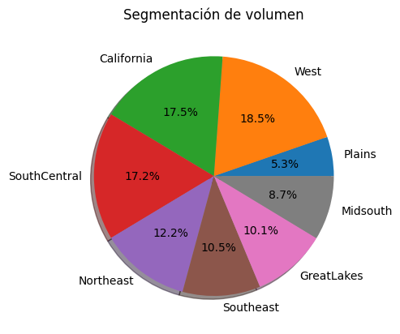
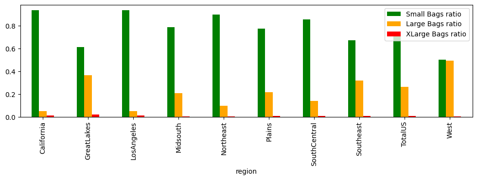
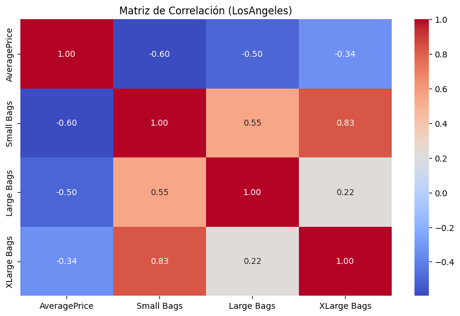
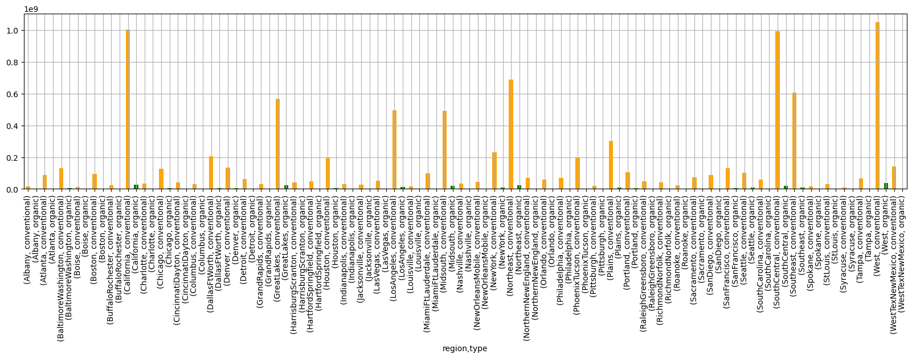
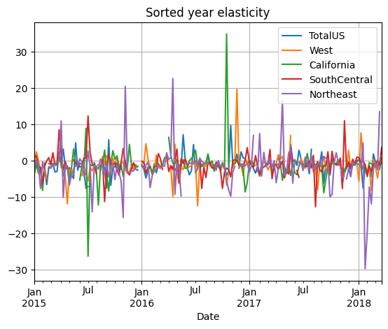
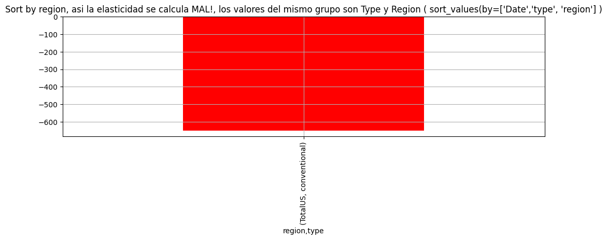
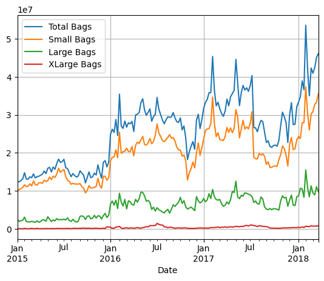

Autores: Xavi,Cesc,Victor

# EDA

### Normalización de datos y validación

* Utilizamos info() para revisar la estructura y los tipos de datos del conjunto.
    * Los detalles concretos con shape, columns o dtypes.
* Clasificación de región en Regiones y Ciudades
* Explorar datos, fechas, nulos, columnas innecesarias
* Discusión sobre qué hacer con los datos de semanas que faltan (interpolante)

##### Mostrar la estructura de datos del dataset avocados


    <class 'pandas.core.frame.DataFrame'>
    RangeIndex: 18249 entries, 0 to 18248
    Data columns (total 15 columns):
     #   Column          Non-Null Count  Dtype         
    ---  ------          --------------  -----         
     0   index           18249 non-null  int64         
     1   Date            18249 non-null  datetime64[ns]
     2   AveragePrice    18249 non-null  float64       
     3   Total Volume    18249 non-null  float64       
     4   Volume_Hass_S   18249 non-null  float64       
     5   Volume_Hass_L   18249 non-null  float64       
     6   Volume_Hass_XL  18249 non-null  float64       
     7   Total Bags      18249 non-null  float64       
     8   Small Bags      18249 non-null  float64       
     9   Large Bags      18249 non-null  float64       
     10  XLarge Bags     18249 non-null  float64       
     11  type            18249 non-null  object        
     12  year            18249 non-null  int64         
     13  region          18249 non-null  object        
     14  region_class    18249 non-null  object        
    dtypes: datetime64[ns](1), float64(9), int64(2), object(3)
    memory usage: 2.1+ MB
    None
   
   > [!NOTE] Junto a la estructura tambien comprobamos que no hay valores nulos en el dataset. 18249 filas y 18249 valores no nulos en cada columna.


   
    Forma del DataFrame (filas, columnas): (18249, 17)
    
    Nombres de Columnas: Index(['index', 'Date', 'AveragePrice', 'Total Volume', 'Volume_Hass_S',
           'Volume_Hass_L', 'Volume_Hass_XL', 'Total Bags', 'Small Bags',
           'Large Bags', 'XLarge Bags', 'type', 'year', 'region', 'region_class',
           'Suma Volums', 'Variacio'],
          dtype='object')
    
    Tipos de datos de cada columna:
    index                      int64
    Date              datetime64[ns]
    AveragePrice             float64
    Total Volume             float64
    Volume_Hass_S            float64
    Volume_Hass_L            float64
    Volume_Hass_XL           float64
    Total Bags               float64
    Small Bags               float64
    Large Bags               float64
    XLarge Bags              float64
    type                      object
    year                       int64
    region                    object
    region_class              object
    Suma Volums              float64
    Variacio                 float64
    dtype: object


> [!NOTE] Convertimos Date en formato datetime64 y anyadimos columna region_class a partir de la siguiente clasificación de regions,grandes regions y ciudades


#### Nuestra clasificacion de clases de regiones: ['City' 'Region' 'GreaterRegion' 'TotalUS']


    {'California': 'GreaterRegion',
     'GreatLakes': 'GreaterRegion',
     'Midsouth': 'GreaterRegion',
     'Northeast': 'GreaterRegion',
     'Plains': 'GreaterRegion',
     'SouthCentral': 'GreaterRegion',
     'Southeast': 'GreaterRegion',
     'West': 'GreaterRegion'}


    {'BaltimoreWashington': 'Region',
     'BuffaloRochester': 'Region',
     'CincinnatiDayton': 'Region',
     'DallasFtWorth': 'Region',
     'HarrisburgScranton': 'Region',
     'HartfordSpringfield': 'Region',
     'MiamiFtLauderdale': 'Region',
     'NewOrleansMobile': 'Region',
     'NorthernNewEngland': 'Region',
     'PhoenixTucson': 'Region',
     'RaleighGreensboro': 'Region',
     'RichmondNorfolk': 'Region',
     'SouthCarolina': 'Region',
     'WestTexNewMexico': 'Region'}


##### Mostrar los top 10 por Total Volume


<div>
<style scoped>
    .dataframe tbody tr th:only-of-type {
        vertical-align: middle;
    }

    .dataframe tbody tr th {
        vertical-align: top;
    }

    .dataframe thead th {
        text-align: right;
    }
</style>
<table border="1" class="dataframe">
  <thead>
    <tr style="text-align: right;">
      <th></th>
      <th>region</th>
      <th>Total Volume</th>
    </tr>
  </thead>
  <tbody>
    <tr>
      <th>51</th>
      <td>TotalUS</td>
      <td>5.864740e+09</td>
    </tr>
    <tr>
      <th>52</th>
      <td>West</td>
      <td>1.086779e+09</td>
    </tr>
    <tr>
      <th>6</th>
      <td>California</td>
      <td>1.028982e+09</td>
    </tr>
    <tr>
      <th>45</th>
      <td>SouthCentral</td>
      <td>1.011280e+09</td>
    </tr>
    <tr>
      <th>29</th>
      <td>Northeast</td>
      <td>7.132809e+08</td>
    </tr>
    <tr>
      <th>46</th>
      <td>Southeast</td>
      <td>6.152384e+08</td>
    </tr>
    <tr>
      <th>15</th>
      <td>GreatLakes</td>
      <td>5.896425e+08</td>
    </tr>
    <tr>
      <th>25</th>
      <td>Midsouth</td>
      <td>5.083494e+08</td>
    </tr>
    <tr>
      <th>22</th>
      <td>LosAngeles</td>
      <td>5.078965e+08</td>
    </tr>
    <tr>
      <th>35</th>
      <td>Plains</td>
      <td>3.111885e+08</td>
    </tr>
  </tbody>
</table>
</div>


##### Identificar fechas faltantes por cada region

    

    
>[!NOTE] Se comprueba que todas los registros estan referenciados a semanas, pero en algunas semanas no hay datos, sin existir nulos en el fichero. Exploramos los datos y vemos que sólo en un caso WesTexNewMexico faltan datos de dos semanas.

###  Verificamos que Total Bags = Small Bags + Large Bags + XLarge Bags


    

    
[!NOTE] Comprobamos que el valor de Total Bags se corresponde a la suma de los tamaños Small+Large+XLarge. Todos los valores del histograma muestran que la diferencia es cero.

# ANALISIS

### Visión global de datos
> [!NOTE] Con el fin de simplificar futuros modelos, comprobamos si la suma de Total Volume de Grandes Regiones y Regiones es parecida o igual al Total Volume de Total US. Vemos que su diferencia es insignificante (3.751252636661604e-09 %)

> [!NOTE] A continuación desglosamos las ventas totales para ver qué regiones son las mayores

    

  

> [!NOTE] La región West aparece como la mayor de ellas seguida de California y SouthCentral. 

##### Correlación de "Volumen Total" de las grandes regiones con Volumen de "Total US" (alvocado conventional)


    

    


> [!NOTE] De la matriz de correlación se observa que los volumenes de TotalUS y West están altamente correlacionadas.

##### Precios promedio calibre tanto Convencional como Orgánico
> [!NOTE] Buscamos la contribución de cada calibre a la formación del  precio medio del avocado mediante la matriz de correlación

    

    
> [!NOTE] Observamos que no hay variables correlacionadas por lo que el volumen de ventas de un calibre específico no influye en la determinación del precio medio.


```python
corr_df= df_cp_cleaned[['Total Volume', 'Volume_Hass_S', 'Volume_Hass_L', 'Volume_Hass_XL']]
# Calcular la matriz de correlación
corr_matrix = corr_df.corr()

# Visualizar la matriz de correlación
plt.figure(figsize=(10, 6))
sns.heatmap(corr_matrix, annot=True, cmap='coolwarm', fmt='.2f')
plt.title('Matriz de correlación Total Volume - Calibres', fontweight = "bold")
plt.show()

# Identificar columnas con correlación alta (umbral = 0.8)
threshold = 0.8
to_drop = []
for column in corr_matrix.columns:
    if any((corr_matrix[column].abs() > threshold) & (corr_matrix.index != column)):
        to_drop.append(column)
        
print(f"Variables altamente correlacionadas con otras: {to_drop}")
```


    

    


    Variables altamente correlacionadas con otras: ['Total Volume', 'Volume_Hass_S', 'Volume_Hass_L']


##### Proporción de calibres sobre Total Volume


```python
fig, ax= plt.subplots(figsize=(20,8))
ratio_bag=df_avocado_size.groupby('region')[['Volume_Hass_S ratio', 'Volume_Hass_L ratio', 'Volume_Hass_XL ratio']].mean()
ratio_bag.plot(kind='bar', color=['green', 'orange', 'red'],ax=ax )
plt.title('Proporcion Calibres Alvocado por region', fontweight = "bold")
plt.ylabel('Proporcion calibre')
plt.xlabel('Region')
plt.show()
```


    

    


##### Proporción por tipo de bolsa sobre Total Bags


```python
df_baggy = df_cp.copy()
region_largest= df_cp.groupby('region')['Total Volume'].sum().nlargest(10).index
df_baggy = df_baggy[df_baggy['region'].isin(region_largest)]

df_baggy['Small Bags ratio'] = df_baggy['Small Bags'] / df_baggy['Total Bags']
df_baggy['Large Bags ratio'] = df_baggy['Large Bags'] / df_baggy['Total Bags']
df_baggy['XLarge Bags ratio'] = df_baggy['XLarge Bags'] / df_baggy['Total Bags']

fig, ax= plt.subplots(figsize=(12,3))
ratio_bag=df_baggy.groupby('region')[['Small Bags ratio','Large Bags ratio', 'XLarge Bags ratio']].mean()
ratio_bag.plot(kind='bar', color=['green', 'orange', 'red'],ax=ax )
plt.title('Proporcion tamaños bolsas por region', fontweight = "bold")
plt.ylabel('Proporcion Tamaños bolsas')
plt.xlabel('Region')
plt.show()
```


    

    


```python
corr_df= df_baggy[['AveragePrice', 'Small Bags', 'Large Bags', 'XLarge Bags']]
# Calcular la matriz de correlación
corr_matrix = corr_df.corr()

# Visualizar la matriz de correlación
plt.figure(figsize=(10, 6))
sns.heatmap(corr_matrix, annot=True, cmap='coolwarm', fmt='.2f')
plt.title('Matriz de Correlación (nlargest(10))', fontweight = "bold")
plt.show()

# Identificar columnas con correlación alta (umbral = 0.8)
threshold = 0.8
to_drop = []
for column in corr_matrix.columns:
    if any((corr_matrix[column].abs() > threshold) & (corr_matrix.index != column)):
        to_drop.append(column)
        
print(f"Variables altamente correlacionadas con otras: {to_drop}")
```


    

    


    Variables altamente correlacionadas con otras: ['Small Bags', 'Large Bags']


```python
df_baggy = df_cp.copy()
region_largest= df_cp.groupby('region')['Total Volume'].sum().nlargest(10).index
df_baggy = df_baggy[df_baggy['region'].isin(region_largest)]

df_baggy['Small Bags ratio'] = df_baggy['Small Bags'] / df_baggy['Total Bags']
df_baggy['Large Bags ratio'] = df_baggy['Large Bags'] / df_baggy['Total Bags']
df_baggy['XLarge Bags ratio'] = df_baggy['XLarge Bags'] / df_baggy['Total Bags']

df_baggy=df_baggy[df_baggy['region']=='LosAngeles']

corr_df= df_baggy[['AveragePrice', 'Small Bags', 'Large Bags', 'XLarge Bags']]
# Calcular la matriz de correlación
corr_matrix = corr_df.corr()

# Visualizar la matriz de correlación
plt.figure(figsize=(10, 6))
sns.heatmap(corr_matrix, annot=True, cmap='coolwarm', fmt='.2f')
plt.title('Matriz de Correlación (LosAngeles)', fontweight = "bold")
plt.show()

# Identificar columnas con correlación alta (umbral = 0.8)
threshold = 0.8
to_drop = []
for column in corr_matrix.columns:
    if any((corr_matrix[column].abs() > threshold) & (corr_matrix.index != column)):
        to_drop.append(column)
        
print(f"Variables altamente correlacionadas con otras: {to_drop}")
```


    

    


    Variables altamente correlacionadas con otras: ['Small Bags', 'XLarge Bags']


##### Precio medio y volumen total
Observaciones:
* Estamos mostrado los de tipo convencional. Que son los grupos de puntos de la parte derecha ? TotalUS y Grandes Regions.


```python
# df_cp_tmp = df_cp[df_cp['type']=='conventional']

# fig, ax = plt.subplots(1, 2, figsize=(18, 6))
# ax[0].scatter(df_cp_tmp['AveragePrice'], df_cp_tmp['Total Volume'], alpha=0.5)
# ax[0].set_title('Relación entre Precio medio y volumen total de no organicos')
# ax[0].set_xlabel('Averag ePrice')
# ax[0].set_ylabel('Total Volume')
# ax[0].grid()

# ax[1].scatter(df_cp_tmp['AveragePrice'], df_cp_tmp['Total Volume'], alpha=0.5)
# ax[1].set_title('Relación entre Precio medio y volumen total de no organicos (Log)')
# ax[1].set_xlabel('Averag ePrice')
# ax[1].set_ylabel('Total Volume')
# ax[1].grid()
# ax[1].set_yscale('log')

# plt.tight_layout()
# plt.show()
# # df_cp.groupby(by=['region']).count()

classification_colors = {'City':'green' ,'Region':'red' ,'GreaterRegion':'orange', 'TotalUS': 'blue'}

df_subset = df_cp.copy()
#df_subset = av.df("df_city_region") 
#df_subset = df_cp[df_cp['region']!= 'TotalUS']

df_organic = df_subset[df_subset['type']=='organic']
df_convencionals = df_subset[df_subset['type']=='conventional']

fig, ax= plt.subplots(figsize=(12,4))
x_values = df_convencionals['Total Volume']
y_values = df_convencionals['AveragePrice']
c_values= list(df_convencionals['region_class'].map(classification_colors))
plt.scatter(x= x_values, y= y_values, c=c_values, alpha = .5)
plt.title('Tipo convencionales (log)', fontweight = "bold")
plt.xscale('log')
plt.ylabel('Average price')
plt.xlabel('Market size')
legend_patches = [mpatches.Patch(color=color, label=region) for region, color in classification_colors.items()]
plt.legend(handles=legend_patches, loc='upper right')
plt.grid()
plt.show()

fig, ax= plt.subplots(figsize=(12,4))
x_values = df_organic['Total Volume']
y_values = df_organic['AveragePrice']
c_values= list(df_organic['region_class'].map(classification_colors))
plt.scatter(x= x_values, y= y_values, c=c_values, alpha = .5)
plt.title('Tipo organicos (log)', fontweight = "bold")
plt.xscale('log')
plt.ylabel('Average price')
plt.xlabel('Market size')
legend_patches = [mpatches.Patch(color=color, label=region) for region, color in classification_colors.items()]
plt.legend(handles=legend_patches, loc='upper right')
plt.grid()
plt.show()
```


    

    


    

    


##### Separar avocados convencionales y organicos
Observaciones:
* TODO: Aqui es veu clarament que el alvocat més relevant es el convencional per ordres de magnitud, per ho que seria relevant fer algún estudi del subset eliminant els organics o estudian-los per separat.
* Addicionalment, l'any 2018 no esta complert, pot afectar a les dades.


```python
grouped = df_cp.groupby(['year', 'type'])['Total Volume'].sum()
fig, ax= plt.subplots(figsize=(12,3))
grouped.plot(kind='bar', color=[color_conv, color_orga])
plt.xlabel('Año y tipo')
plt.ylabel('Total Volume')
plt.title('Volumen ventas total por año y tipo de aguacate', fontweight = "bold")
plt.xticks(rotation=45, ha='right')
plt.show()
```


    

    


```python
df_grouped = df_cp.groupby('Date')['AveragePrice'].mean()

plt.figure(figsize=(12, 3))
plt.plot(df_grouped, label ='Precio Medio')
plt.legend(loc='best')
plt.xlabel('Tiempo')
plt.ylabel('Precio medio')
plt.title('Precio medio en el tiempo', fontweight = "bold")
plt.grid(True); plt.xticks(rotation=0)
plt.show()

df_grouped = df_cp.groupby(pd.Grouper(key='Date', freq='M'))['AveragePrice'].mean()
plt.figure(figsize=(12,3))
plt.plot(df_grouped, label='Precio medio mensual') #plt.plot(df_grouped.index, df_grouped.values)
plt.legend(loc='best')
plt.xlabel('Fecha')
plt.ylabel('Precio medio')
plt.title('Precio medio mensual', fontweight = "bold")
plt.grid(True); plt.xticks(rotation=0)
plt.show()

df_cp_conventional = df_cp[df_cp['type'] =='conventional'] #[['Date', 'AveragePrice']]
df_grouped_conv = df_cp_conventional.groupby('Date')['AveragePrice'].mean()

df_cp_organic = df_cp[df_cp['type'] =='organic'] #[['Date', 'AveragePrice']]
df_grouped_orga = df_cp_organic.groupby('Date')['AveragePrice'].mean()

plt.figure(figsize=(12, 3))
plt.plot(df_grouped_conv, label ='Precio Medio convencional', color ='grey')
plt.plot(df_grouped_orga, label ='Precio Medio organic', color ='green')
plt.legend(loc='best')
plt.xlabel('Tiempo')
plt.ylabel('Precio medio')
plt.title('Precio medio en el tiempo segun tipo alvocado', fontweight = "bold")
plt.grid(True); plt.xticks(rotation=0)
plt.show()

#df_grouped
```


    

    


    /tmp/ipykernel_789/2164066208.py:12: FutureWarning: 'M' is deprecated and will be removed in a future version, please use 'ME' instead.
      df_grouped = df_cp.groupby(pd.Grouper(key='Date', freq='M'))['AveragePrice'].mean()


    

    


    

    


##### Comparación precios promedio convencional y organico
Observaciones:
* TODO: Aqui veiem que existeixen unes regions mes relevants que altres. Caldria fer una separació?
* TODO: Excloure TotalUS ??


```python
df_subset = df_cp
df_subset = df_cp[df_cp['region']!= 'TotalUS']
pd.unique(df_subset['region'])

grouped = df_subset.groupby(['region', 'type'])['Total Volume'].sum()

fig, ax= plt.subplots(figsize=(20,4))
grouped.plot(kind='bar', ax=ax, color = [color_conv, color_orga] )
# plt.ylim(0, 0.3*10**9)
# plt.yscale('log')
plt.title('Volumen ventas por region y tipo ', fontweight = "bold")
plt.ylabel('Volumen ventas')
plt.grid()
plt.show()
```


    

    


```python
df_subset = df_cp
price_group = df_subset.groupby(['region', 'type'])['AveragePrice'].mean()#.nlargest(10)

fig, ax= plt.subplots(figsize=(20,4))
price_group.plot(kind='bar', ax=ax, color = [color_conv, color_orga] )
plt.title('Precio medio por region y tipo ', fontweight = "bold")
plt.ylabel('Precio medio')
# plt.ylim(0, 0.3*10**9)
plt.grid()
plt.show()
```


    

    


Observaciones:
* TODO: Aquest gràfic es espectacular, y ens permet veure que sempre són els alvocats orgànics els que costen més que la mitjana.


```python

```


```python
df_subset = df_cp
avocados_region_mean = df_subset.groupby(['region','type'])['AveragePrice'].mean()#.nlargest(6)

total_mean = df_subset['AveragePrice'].mean()
fig, ax= plt.subplots(figsize=(20,4))
avocados_relative_mean = (avocados_region_mean - total_mean)*100/total_mean
avocados_relative_mean.plot(kind = 'bar', ylabel= '% Price deviation', color = [color_conv, color_orga]) # 'slategray', 'forestgreen'])
plt.title('Desviación del precio respecto la media', fontweight = "bold")
plt.grid()
plt.show()
```


    

    


##### TODO: Convencional vs Organic
Observaciones:
* TODO: 
  * Si mirem la proporcio, en general es manté constant. No hi ha ningun interes per a tornar a ho natural a les gran ciutats o extensions.
  * Si acas hi ha més divergencia en extensions menors.


```python
grouped = df_subset.groupby(['region', 'type'])['Total Volume'].sum()
unstacked_type= grouped.unstack()
unstacked_type['Proportion'] = unstacked_type['conventional']/unstacked_type['organic']

fig, ax= plt.subplots(figsize=(12,4))
x_values= unstacked_type['conventional']
y_values= unstacked_type['Proportion']
ax.scatter(x=x_values, y= y_values )
plt.title('Proporcion convencional vs organicos por region', fontweight = "bold")
plt.ylabel('Proporcion Convencional/Organico')
plt.xlabel('Volumen Mercado de la region')
plt.xscale('log')
# plt.ylim(0, 0.3*10**9)
plt.grid()
plt.show()
```


    

    


##### Ventas en el tiempo y separación entre convencional / orgánico


```python
df_date_volume = df_cp[['Date', 'Total Volume']]
#df_cp_organic = df_cp[df_cp['type'] =='organic'] #[['Date', 'AveragePrice']]
#df_date_volume
df_grouped_conventional = df_date_volume[df_cp['type'] =='conventional'].groupby('Date').sum('Total Volume')
df_grouped_organic = df_date_volume[df_cp['type'] =='organic'].groupby('Date').sum('Total Volume')

# Graficar
plt.figure(figsize=(12,3))
plt.title('Volumen total de ventas a lo targo del tiempo', fontweight = "bold")
plt.plot(df_grouped_conventional, label='Volumen total ventas (conventional)')
plt.xlabel('Fecha')
plt.ylabel('Volumen ventas')
plt.legend(loc='best'); plt.grid(True)
plt.plot(df_grouped_organic, label='Volumen total ventas (organic)')
plt.xlabel('Fecha')
plt.ylabel('Volumen ventas')
plt.legend(loc='best'); plt.grid(True)
plt.show()

plt.figure(figsize=(12,3))
plt.title('Volumen total de ventas a lo targo del tiempo - escala logaritmica', fontweight = "bold")
plt.plot(df_grouped_conventional, label='Volumen total ventas (conventional) escala logaritmica')
plt.xlabel('Fecha')
plt.ylabel('Volumen ventas')
plt.yscale('log')
plt.legend(loc='best'); plt.grid(True)
plt.plot(df_grouped_organic, label='Volumen total ventas (organic) escala logaritmica')
plt.xlabel('Fecha')
plt.ylabel('Volumen ventas')
plt.yscale('log')
plt.legend(loc='best'); plt.grid(True)
plt.show()
```


    

    


    

    


##### Análisis de Cambios en Precios Anuales:


```python
df_year_price = df_cp.groupby('year')['AveragePrice'].mean()
df_year_price_conventional = df_cp[df_cp['type'] =='conventional'].groupby('year')['AveragePrice'].mean()
df_year_price_organic = df_cp[df_cp['type'] =='organic'].groupby('year')['AveragePrice'].mean()
display(df_year_price)

# Graficar
plt.figure(figsize=(10, 2)) 
df_year_price.plot.bar(label ='Precio medio', color = color_total, alpha=1) # x='aaa??',y='bbb??',
plt.xlabel('Año')
plt.ylabel('Precio medio')
plt.title('Precio medio anual', fontweight = "bold")
plt.legend(loc='lower right'); plt.grid(True)
plt.xticks(rotation=0)
plt.show()


plt.figure(figsize=(10, 2)) 
df_year_price_organic.plot.bar(label ='Precio medio alvocado organic', color = color_orga) # x='aaa??',y='bbb??',
df_year_price_conventional.plot.bar(label ='Precio medio alvocado conventional', color = color_conv) # x='aaa??',y='bbb??',
#df_year_price.plot.bar(label ='Precio medio', color ='blue', alpha=0.2) # x='aaa??',y='bbb??',
plt.xlabel('Año')
plt.ylabel('Precio medio')
plt.title('Precio medio anual', fontweight = "bold")
plt.legend(loc='lower right'); plt.grid(True)
plt.xticks(rotation=0)
plt.show()
```


    year
    2015    1.375590
    2016    1.338640
    2017    1.515128
    2018    1.347531
    Name: AveragePrice, dtype: float64


    

    


    

    


##### Analisis de Series Temporales y Ruido asociado

Observaciones:
    * Perido de 52 semanas para ver la evolucion a la lo largo de los 3 años.


```python
print(f"Ragos de fechas: mínima: {df_cp.Date.min()} máxima: {df_cp.Date.max()}")

df_grouped = df_cp.groupby('Date')['AveragePrice'].mean()
#df_cp_grouped = df_cp.copy() #[df_cp['type'] =='conventional']#[['Date', 'AveragePrice']]
df_grouped = df_cp.groupby('Date')['AveragePrice'].mean()

# Descomposicio de la serie de tiemps: 39 mesos si considerem que tenim del 1-1-2015 fins al 25-3-2018
df_decomp = seasonal_decompose(df_grouped, model='additive', period=(int)(52*1)) #maxim: 84

plt.figure(figsize=(10, 2))
plt.plot(df_decomp.observed, label='avocado convencional')
plt.legend(loc='best');plt.grid(True)
plt.title('Tendencia', fontweight = "bold")
plt.ylabel('Precio')
plt.xlabel('Fecha')
plt.tight_layout()
plt.show()

plt.figure(figsize=(10, 2))
plt.plot(df_decomp.trend, color='red', label='Tendencia mensual')
plt.title('Tendencia mensual', fontweight = "bold")
plt.legend(loc='best');plt.grid(True)
plt.xlabel('Fecha')
plt.ylabel('Precio')
#plt.title('Tendencia')
plt.tight_layout()
plt.show()

plt.figure(figsize=(10, 2))
plt.plot(df_decomp.seasonal, label='Estacionalidad')
plt.title('Estacionalidad', fontweight = "bold")
plt.ylabel('Precio')
plt.legend(loc='best');plt.grid(True)
plt.xlabel('Fecha')
#plt.title('Estacionalidad')
plt.tight_layout()
plt.show()

plt.figure(figsize=(10, 2))
plt.plot(df_decomp.resid, color='green', label='Residuo')
plt.legend(loc='best');plt.grid(True)
plt.xlabel('Fecha')
plt.ylabel('Precio')
plt.title('Residuo', fontweight = "bold")
#plt.title('Residuo')
plt.tight_layout()
plt.show()
```

    Ragos de fechas: mínima: 2015-01-04 00:00:00 máxima: 2018-03-25 00:00:00


    

    


    

    


    

    


    

    


```python
df_subset = df_cp[df_cp['region']!= 'TotalUS']
df_organic = df_subset[df_subset['type']=='organic']
df_convencionals = df_subset[df_subset['type']=='conventional']

# df_convencionals
index_df = df_cp_cleaned.copy()
#['West', 'California', 'SouthCentral', 'Northeast', 'Southeast']
great_reg_col = {'California' : 'red', 'West':'Orange', 'SouthCentral':'green', 'Northeast':'SkyBlue', 'Southeast':'DarkBlue'}

region_largest= list(index_df.groupby('region')['Total Volume'].sum().nlargest(5).index)
df_regions = df_convencionals[df_convencionals['region'].isin(region_largest)]
```


```python
fig, ax= plt.subplots(figsize=(16,4))
y_values = df_regions['Total Volume']
x_values = df_regions['Date']
c_values= list(df_regions['region'].map(great_reg_col))

plt.scatter(x= x_values, y= y_values, c=c_values, alpha = 1)
plt.yscale('log')
plt.title('Total Volume en el tiempo (log)', fontweight = "bold")
plt.ylabel('Total Volume')
plt.xlabel('Fecha')
#plt.legend() #loc='lower right')
legend_handles = [plt.Line2D([0], [0], marker='o', color='w', label=region, markerfacecolor=color, markersize=8) for region, color in great_reg_col.items() if region in df_regions['region'].unique()]
plt.legend(handles=legend_handles, loc='best', bbox_to_anchor=(1, 1), ncol=1)
plt.grid()
plt.show()
```


    

    


* Nota: Aquí los outlayers también parecen corresponden con las fechas de la Super Bowl.


```python
fig, ax= plt.subplots(figsize=(16,4))
y_values = df_regions['AveragePrice']
x_values = df_regions['Date']
c_values= list(df_regions['region'].map(great_reg_col))

plt.scatter(x= x_values, y= y_values, c=c_values, alpha = 1)
#plt.yscale('log')
plt.title('Precio medio en el tiempo', fontweight = "bold")
plt.ylabel('AveragePrice')
plt.xlabel('Fecha')
legend_handles = [plt.Line2D([0], [0], marker='o', color='w', label=region, markerfacecolor=color, markersize=8) for region, color in great_reg_col.items() if region in df_regions['region'].unique()]
plt.legend(handles=legend_handles, loc='best', bbox_to_anchor=(1, 1), ncol=1)
plt.grid()
plt.show()
```


    

    


#### Subset alvocados convencionals
* Aqui tendriamos que incluir una idea de si todas las regiones hacen un número similar total de pedidos
* Claramente hay sitios donde los aguacates son más baratos, miremos si tiene que ver con otras características


```python
df_subset = df_cp[df_cp['region']!= 'TotalUS']
df_convencionals = df_subset[df_subset['type']=='conventional']
convencional_region_mean = df_convencionals.groupby('region')['AveragePrice'].mean()#.nlargest(6)
coloring=convencional_region_mean.index.map(av.region_classification).map(av.classification_colors)
total_mean = df_convencionals['AveragePrice'].mean()
fig, ax= plt.subplots(figsize=(20,4))
plt.title('Desviación del precio respecto la media', fontweight = "bold")
avocados_relative_mean = ((convencional_region_mean - total_mean)*100/total_mean)
avocados_relative_mean.plot(kind = 'bar', ylabel= '% Price deviation')#, color= coloring)#, color= convencional_region_mean.index.map(classification_colors))
plt.grid()
plt.show()
```


    

    


#### Majors mercats el preu mig tendeix a abaratirse
* Aqui podem veure que a majors mercats el preu mig tendeix a abaratirse. 
* Aqui estem prenent cada regio com equivalentment valida
* cambiar el 2018 no parece afectar los resultados


```python
convencional_region_mean_total = df_convencionals.groupby('region').agg({'Total Volume':'sum', 'AveragePrice':'mean'})#.nlargest(6)
convencional_region_mean_total['region_class'] = convencional_region_mean_total.index.map(av.region_classification)

x_values = convencional_region_mean_total['Total Volume']
total_mean = convencional_region_mean_total['AveragePrice'].mean()
y_values = (convencional_region_mean_total['AveragePrice'] - total_mean)*100/total_mean
c_values= list(convencional_region_mean_total['region_class'].map(av.classification_colors))

fig, ax= plt.subplots(figsize=(12,6))
plt.scatter(x= x_values, y= y_values, c=c_values)
plt.xscale('log')
plt.title('% Desviación de precio medio Convencional por region', fontweight = "bold")
plt.ylabel('% Average price deviation')
plt.xlabel('Volúmen de mercado de la region')
legend_patches = [mpatches.Patch(color=color, label=region) for region, color in av.classification_colors.items()]
plt.legend(handles=legend_patches, loc='best', bbox_to_anchor=(1, 1), ncol=1)
plt.grid()
plt.show()
```


    

    


```python
df_cp_cleaned = df_cp[df_cp['region_class'] !='TotalUS'].copy()
convencional_region_mean_total = df_cp_cleaned.groupby(['region','type']).agg({'Total Volume':'sum', 'AveragePrice':'mean'})#.nlargest(6)

for region in pd.unique(df_cp_cleaned['region']):
    convencional_region_mean_total.loc[(region, 'organic'),'Total Volume'] = convencional_region_mean_total.loc[(region, 'conventional'),'Total Volume']

new_convencional_region_mean_total= convencional_region_mean_total.reset_index(level='type') 
type_coloring= {'organic':color_orga, 'conventional':color_conv}

fig, ax= plt.subplots(figsize=(20,4))
x_values = new_convencional_region_mean_total['Total Volume']
total_mean = new_convencional_region_mean_total['AveragePrice'].mean()
y_values = (new_convencional_region_mean_total['AveragePrice'] - total_mean)*100/total_mean
c_values= new_convencional_region_mean_total['type'].map(type_coloring)

plt.scatter(x= x_values, y= y_values, c=c_values)
plt.title('% Desviación de precio medio por region y tipo', fontweight = "bold")
plt.ylabel('% Average price deviation')
plt.xlabel('Volúmen de mercado de la region')
plt.grid()
plt.show()
```


    

    


### Gráficos para Visualización de Datos

#### Volumen Total de Ventas


```python
df_cp_cleaned = df_cp.copy()
df_cp_cleaned=df_cp[df_cp.region != 'TotalUS']
volume_by_region = df_cp_cleaned.groupby('region')['Total Volume'].sum().sort_values(ascending=False).to_frame()

sns.set_style('whitegrid')
plt.figure(figsize=(14, 8))
sns.barplot(data=volume_by_region, x='region', y='Total Volume', hue='region', palette='viridis')
plt.xticks(rotation=90)
# Añadir título y etiquetas a los ejes
plt.title('Suma del Volumen Total de Ventas por Región excepto TotalUS', fontweight = "bold")
plt.xlabel('Región')
plt.ylabel('Volumen Total de Ventas')
#plt.yscale('log')

# Mostrar el gráfico
plt.show()
sns.reset_defaults()
```


    

    


```python
df_cp['RegionClass'] = df_cp['region'].map(av.region_classification)
df_cp_cleaned=df_cp[df_cp.region != 'TotalUS']
df_cp_GreaterRegion=df_cp_cleaned[df_cp_cleaned['RegionClass']=='GreaterRegion']
df_cp_GreaterRegion_conv=df_cp_GreaterRegion[df_cp_GreaterRegion['type']=='conventional']
df_cp_GreaterRegion_org=df_cp_GreaterRegion[df_cp_GreaterRegion['type']=='organic']

plt.figure(figsize=(10,6))
sns.set_style('whitegrid')
sns.violinplot(x='region',y='Total Volume', data=df_cp_GreaterRegion)
plt.xlabel('Region',{'fontsize' : 'large'})
plt.ylabel('Total Volume',{'fontsize':'large'})
plt.title("Total Volume en las grandes regiones excepto TotalUS",{'fontsize':10}, fontweight = "bold")
plt.show()
```


    

    


```python
df_cp_TotalUS=df_cp[df_cp['region']=='TotalUS']
plt.figure(figsize=(10,6))
sns.set_style('whitegrid')
sns.violinplot(x='region',y='Total Volume', data=df_cp_TotalUS)
plt.xlabel('Region',{'fontsize' : 'large'})
plt.ylabel('Total Volume',{'fontsize':'large'})
plt.title("Total Volume de TotalUS",{'fontsize':10}, fontweight = "bold")
plt.show()
```


    

    


##### Conclusiones: En el gráfico de violín se observan la presencia de dos valores de concentración de datos , estas dos zonas aparecen en todas las regiones.
##### Ello induce a pensar que hay dos categorias de datos en cada región.


```python
plt.figure(figsize=(10,6))
sns.set_style('whitegrid')
sns.violinplot(x='region',y='Total Volume', data=df_cp_GreaterRegion_conv)
plt.xlabel('Region',{'fontsize' : 'large'})
plt.ylabel('Total Volume',{'fontsize':'large'})
plt.title("Total Volume de aguacate convencional",{'fontsize':10}, fontweight = "bold")
plt.show()
```


    

    


```python
plt.figure(figsize=(10,6))
sns.set_style('whitegrid')
sns.violinplot(x='region',y='Total Volume', data=df_cp_GreaterRegion_org)
plt.xlabel('Region',{'fontsize' : 'large'})
plt.ylabel('Total Volume',{'fontsize':'large'})
plt.title("Total Volume de aguacate orgánico",{'fontsize':10}, fontweight = "bold")
plt.show()
```


    

    


#### Boxplot Comparativo de Precios entre Años


```python
df_cp_cleaned = df_cp[df_cp['region_class'] !='TotalUS'].copy()
plt.figure(figsize=(12,4))
sns.boxplot(df_cp_cleaned, x="year", y="AveragePrice", hue='type', fill=False, gap=0.5)
plt.title("Average Price por año y tipo", fontweight = "bold") #,{'fontsize':40})
plt.xlabel('Año') #,{'fontsize' : 30})
plt.ylabel('Precio medio') #,{'fontsize':'large'})
plt.grid()
plt.show()
sns.reset_defaults()
```


    

    


##### En el boxplot incluyendo todos las regiones se observan numerosos outliers.
##### En el año 2016 hay mayor dispersión aunque la mediana es practicamente la misma.


```python
plt.figure(figsize=(12, 6))
plt.title('Distribución de AveragePrice en Grandes Regiones y por año',{'fontsize':10}, fontweight = "bold")
plt.xlabel('Año')
plt.ylabel('Average Price')
sns.boxplot(data=df_cp_GreaterRegion, x='year', y='AveragePrice', hue='year', palette='Pastel1', notch=True)
sns.stripplot(data=df_cp_GreaterRegion, x='year', y='AveragePrice',alpha=0.3)
plt.show()

```


    

    


##### Conclusiones: las ciudades y regiones al ser más pequeñas introducen más variabilidad en el precio


```python
plt.figure(figsize=(12,6))

plt.xlabel('Año',{'fontsize' : 'large'})
plt.ylabel('Region',{'fontsize':'large'})
plt.title(" Distribución Average Price convencional por año en Grandes Regiones",{'fontsize':10}, fontweight = "bold")
sns.stripplot(data=df_cp_GreaterRegion_conv, x='year', y='AveragePrice',alpha=0.3)
sns.boxplot(data=df_cp_GreaterRegion_conv, x='year', y='AveragePrice', hue='year', palette='Pastel1', notch=True)
plt.show()

```


    

    


```python
plt.figure(figsize=(12,6))
sns.boxplot(data=df_cp_GreaterRegion_org, x='year', y='AveragePrice', hue='year', palette='Pastel1', notch=True)
plt.xlabel('Año',{'fontsize' : 'large'})
plt.ylabel('Region',{'fontsize':'large'})
plt.title("Distribución Average Price organico por año en Grandes Regiones",{'fontsize':10}, fontweight = "bold")
sns.stripplot(data=df_cp_GreaterRegion_org, x='year', y='AveragePrice',alpha=0.3)
plt.show()
```


    

    


```python
df_cp = av.df("df_cp")
df_cp_organic = df_cp[df_cp['type'] =='organic']
#regiones = ['West', 'California']
regiones = av.Manager.obtener_regions('GreaterRegion')
df_filtrado = df_cp_organic[df_cp_organic['region'].isin(regiones)]

plt.figure(figsize=(20,4))
sns.boxplot(df_filtrado, x="year", y="AveragePrice", hue="region", dodge=True, fill=False, gap=.2)
plt.title("Average Price Organico por año y region",{'fontsize':20}, fontweight = "bold")
plt.xlabel('Año')#,{'fontsize' : 'large'})
plt.ylabel('Region')#,{'fontsize':'large'})
plt.legend(loc='best') #, bbox_to_anchor=(1, 1), ncol=1)
plt.show()
```


    

    


#### Precios Promedios por Año


```python
y=df_cp.groupby(['year'])['AveragePrice'].mean()
x=(df_cp['year'].unique())
plt.figure(figsize=(10, 6))
plt.plot(x, y)
plt.title('Precios Promedios por Año', fontweight = "bold")
plt.ylabel('Precio promedio')
plt.xlabel('Año')
plt.grid()
plt.show()
```


    

    


#### Separar alvocados convencionales y organicos


```python
df_cp = av.df("df_cp")
average_prices = df_cp['AveragePrice']
print(f"AveragePrice: min: {df_cp['AveragePrice'].min()} max: {df_cp['AveragePrice'].max()}")

plt.figure(figsize=(10, 6))
sns.histplot(average_prices, bins=100, kde=True, color='skyblue')
plt.title('Histogram of Average Avocado Prices', fontweight = "bold")
plt.xlabel('Average Price')
plt.ylabel('Frequency')
plt.grid()
plt.show()
```

    AveragePrice: min: 0.44 max: 3.25


    

    


```python
df_cp = av.df("df_cp")
average_price_by_type = df_cp.groupby('type')['AveragePrice'].mean()
print(average_price_by_type)

plt.figure(figsize=(10, 6))
plt.hist(
    [df_cp_cleaned[df_cp_cleaned['type'] == 'conventional']['AveragePrice'], 
     df_cp_cleaned[df_cp_cleaned['type'] == 'organic']['AveragePrice']],
    bins=100, label=['Conventional', 'Organic'], alpha=0.9
)

# Add titles and labels
plt.title("Histogram of Average Avocado Prices by Type", fontweight = "bold")
plt.xlabel("Average Price")
plt.ylabel("Frequency")
plt.legend(loc='upper right')
plt.grid()
plt.show()
```

    type
    conventional    1.158040
    organic         1.653999
    Name: AveragePrice, dtype: float64


    

    


```python
df_cp_conventional = av.df("df_cp_conventional")

plt.figure(figsize=(10, 6))
plt.title('Histograma de Ventas Totales en Greater Regions Tipo Convencional', fontweight = "bold")
plt.hist(df_cp_conventional['Total Volume'], bins=50, color='skyblue', edgecolor='black')
plt.xlabel('Total Volume')
plt.ylabel('Frecuencia')
plt.show()
```


    

    


```python
df_cp_organic = av.df("df_cp_organic")

plt.figure(figsize=(10, 6))
plt.title('Histograma de Ventas Totales en Greater Regions  Tipo Organico', fontweight = "bold")
plt.hist(df_cp_organic['Total Volume'], bins=50, color='skyblue', edgecolor='black')
plt.xlabel('Total Volume')
plt.ylabel('Frecuencia')
plt.show()
```


    

    


#### Ventas por Tipo de Bolsa


```python
tipos_bolsas=['Total Bags','Small Bags','Large Bags','XLarge Bags']
ventas=[df_cp['Total Bags'].sum(),df_cp['Small Bags'].sum(),df_cp['Large Bags'].sum(),df_cp['XLarge Bags'].sum()]

plt.figure(figsize=(10, 6))
plt.title('Grafico de Barras por Tipo de Bolsa', fontweight = "bold")
plt.xlabel("Tipo de Bolsa")
plt.ylabel("Ventas")
plt.grid()
plt.bar(tipos_bolsas,ventas, color = color_total, width=0.4)
```


    <BarContainer object of 4 artists>


```python
df_cp_organic = av.df("df_cp_organic")
df_cp_conventional = av.df("df_cp_conventional")

ventas_org=[df_cp_organic['Total Bags'].sum(),df_cp_organic['Small Bags'].sum(),df_cp_organic['Large Bags'].sum(),df_cp_organic['XLarge Bags'].sum()]
ventas_conv=[df_cp_conventional['Total Bags'].sum(),df_cp_conventional['Small Bags'].sum(),df_cp_conventional['Large Bags'].sum(),df_cp_conventional['XLarge Bags'].sum()]

x = np.arange(len(tipos_bolsas))  # Posición de cada tipo de bolsa
width = 0.35
plt.figure(figsize=(10, 6))
plt.bar(x + width/2, ventas_org, width, label='Orgánico', color= color_orga)
plt.bar(x - width/2, ventas_conv, width, label='Convencional', color= color_conv)
plt.title('Ventas por Tipo de Bolsa: Orgánica vs Convencional', fontweight="bold")
plt.xlabel("Tipo de Bolsa")
plt.ylabel("Ventas")
plt.xticks(x, tipos_bolsas)  # Posicionar etiquetas en el centro de los grupos de barras
plt.legend()
plt.show()
```


    

    


    

    


```python
df_cp_organic = av.df("df_cp_organic")
ventas_org=[df_cp_organic['Total Bags'].sum(),df_cp_organic['Small Bags'].sum(),df_cp_organic['Large Bags'].sum(),df_cp_organic['XLarge Bags'].sum()]
plt.figure(figsize=(10, 6))
plt.title('Grafico de Barras por Tipo de Bolsa Organica', fontweight = "bold")
plt.xlabel("Tipo de Bolsa")
plt.ylabel("Ventas")
plt.bar(tipos_bolsas,ventas_org, color = color_orga, width=0.4)
plt.show()

df_cp_conventional = av.df("df_cp_conventional")
ventas_conv=[df_cp_conventional['Total Bags'].sum(),df_cp_conventional['Small Bags'].sum(),df_cp_conventional['Large Bags'].sum(),df_cp_conventional['XLarge Bags'].sum()]
plt.figure(figsize=(10, 6))
plt.title('Grafico de Barras por Tipo de Bolsa Convencional', fontweight = "bold")
plt.xlabel("Tipo de Bolsa")
plt.ylabel("Ventas")
plt.bar(tipos_bolsas,ventas_conv, color = color_conv, width=0.4)
plt.show()
```


    

    


    

    


#### Total Volume respecto al conjunto de volumenes por calibres de HASS S, L y XL


```python
# Para seleccionar unicamente las regiones propias , descartamos Total US para la vista gráfica
df_cp_cleaned = df_cp[df_cp.region != 'TotalUS'].copy() 
df_cp_cleaned['Suma Volums'] = df_cp_cleaned['Volume_Hass_S'] + df_cp_cleaned['Volume_Hass_L'] + df_cp_cleaned['Volume_Hass_XL']
df_cp_cleaned['Variacio'] = (df_cp_cleaned['Total Volume'] - df_cp_cleaned['Suma Volums']) *100 /df_cp_cleaned['Total Volume']
# df_cp_cleaned_city = df_cp_cleaned[df_cp_cleaned['region_class']=='City']
region_largest= df_cp_cleaned.groupby('region')['Total Volume'].sum().nlargest(5).index

plt.figure(figsize=(10, 6))
transparencia = 1
for region in region_largest:#, 'TotalUS']:#.nlargest(6)
    df_cp_temp = df_cp_cleaned[df_cp_cleaned['region'] ==region]
    df_cp_temp['Variacio'].hist(bins=50, label=str(region), alpha = transparencia)
    plt.title('Distribución del % variación Total Volume respecto als conjunto de calibres')
    plt.xlabel('% variación')
    plt.ylabel('Frecuencia')
    plt.legend(loc='best')
    transparencia-=0.2
plt.show()

plt.figure(figsize=(10, 6))
transparencia = 1
for region in ['LosAngeles', 'NewYork', 'Houston']:#, 'TotalUS']:#.nlargest(6)
    df_cp_temp = df_cp_cleaned[df_cp_cleaned['region'] ==region]
    df_cp_temp['Variacio'].hist(bins=50, label=str(region), alpha = transparencia)
    plt.title('Distribución del % variación Total Volume respecto als conjunto de calibres')
    plt.xlabel('% variación')
    plt.ylabel('Frecuencia')
    plt.legend(loc='best')
    transparencia-=0.3
plt.show()
```


    

    


    

    


#### Impacto del precio en las ventas
* TODO: Aqui podem veure que a majors mercats el preu mig tendeix a abaratirse. 
* Aqui estem prenent cada regio com equivalentment valida  cambiar el 2018 no parece afectar los resultados


```python
convencional_df = df_cp_cleaned[df_cp_cleaned['type']=='conventional']
organic_df = df_cp_cleaned[df_cp_cleaned['type']=='organic']

convencional_region_mean_total = convencional_df.groupby('region').agg({'Total Volume':'sum', 'AveragePrice':'mean'})#.nlargest(6)
organic_region_mean_total = organic_df.groupby('region').agg({'AveragePrice':'mean'})#.nlargest(6)

convencional_region_mean_total['Price difference'] = organic_region_mean_total['AveragePrice'] - convencional_region_mean_total['AveragePrice'] 

# display(new_df)
fig, ax= plt.subplots(figsize=(20,4))
x_values = convencional_region_mean_total['Total Volume']
# total_mean = new_convencional_region_mean_total['AveragePrice'].mean()
y_values = convencional_region_mean_total['Price difference'] #(new_convencional_region_mean_total['AveragePrice'] - total_mean)*100/total_mean
# c_values= convencional_region_mean_total['type'].map(type_coloring)

plt.scatter(x= x_values, y= y_values)#, c=c_values)
plt.title('Impacto del precio en las ventas')
plt.ylabel('Price difference organic vs conventional')
plt.xlabel('Market size')
plt.grid()
plt.show()
```


    

    


#### Estacionalidad por región
* Se observa que en general el precio es más alto en verano y otoño.


```python
get_season = av.get_season()
df_date_price_volume = df_cp.copy()
df_date_price_volume = df_date_price_volume[df_date_price_volume['region'] != 'TotalUS']
df_date_price_volume = df_date_price_volume[['Date', 'region', 'AveragePrice', 'Total Volume']]
df_date_price_volume['Season'] = df_date_price_volume['Date'].apply(get_season)

df_grouped_mean = df_date_price_volume.groupby(['Season','region'])['AveragePrice'].mean()
df_grouped_mean = df_grouped_mean.reset_index()

seasons = df_grouped_mean['Season'].unique()
plt.figure(figsize=(20, 8)) 
for season in seasons:
    df_season = df_grouped_mean[df_grouped_mean['Season'] == season]
    plt.plot(df_season['region'], df_season['AveragePrice'], marker='.', label=season)
plt.title('Precio medio por temporada y región')
plt.xlabel('Región')
plt.ylabel('Precio medio')
plt.xticks(rotation=90)
plt.grid(True)
plt.legend()
plt.tight_layout()
plt.show()
#df_grouped_mean
```


    

    


##### Fechas con explosión de ventas
* TODO: Super Bowl
  * 2015: 2 de febrero
  * 2016: 7 de febrero
  * 2017: 6 de febrero
  * 2018: 5 de febrero


```python
prova_= df_cp.copy()
index_df= df_cp.copy()
prova_= prova_[prova_['type']=='conventional']

index_df= index_df[index_df['region_class']=='GreaterRegion']
region_largest= list(index_df.groupby('region')['Total Volume'].sum().nlargest(5).index)
# region_largest.append('TotalUS')

fig, ax= plt.subplots(figsize=(20,4))
for region in region_largest:
    prova_temp = prova_[prova_['region']==region]
    prova_temp=prova_temp.sort_values(by='Date')
    prova_temp.plot(x= 'Date', y= 'Total Volume', ax=ax, label= region)
plt.legend(loc='best'); plt.grid(True)
plt.show()
```


    

    


##### TODO


```python
#df_cp_cleaned = av.df("df_cleaned")
prova_= df_cp.copy()
index_df= df_cp.copy()
prova_= prova_[prova_['type']=='conventional']

#great_dates= df_cp_cleaned.copy()
#great_dates= great_dates[great_dates['type']=='conventional']

index_df= df_cp.copy()
index_df= index_df[index_df['region_class']=='GreaterRegion']

region_largest= list(index_df.groupby('region')['Total Volume'].sum().nlargest(5).index)
#region_largest#.append('TotalUS')
fig, ax= plt.subplots(figsize=(20,6))
for region in region_largest:
    prova_temp = prova_[prova_['region']==region]
    prova_temp=prova_temp.sort_values(by='Date')
    prova_temp.plot(x= 'Date', y= 'AveragePrice', ax=ax, label= region)

plt.grid()
plt.show()
```


    

    


### Elasticidad

#### Further studies

* Els apartats anteriors han mostrat tendencies claras, pero encara aixi es complicat separar els efectes de convergencia de múltiples variables. Es per això que tractarem de fer subsets per a veure els efectes mes clars.
* Addicionalment tractarem de fer els càlculs d'elasticitat un cop fetes les separacions en el df

#### 2.1. Elasticidad Sobre el tiempo (Conventional USA)


```python
# Creacion de la variable elasticidad y eliminacion de valores no utiles
df_cp_elast = df_cp.copy()

# Sort by year, asi la elasticidad se calcula entre los valores del mismo grupo
df_sort = df_cp_elast.sort_values(by=['region','type', 'year'])

df_USA = df_sort[df_sort['region']=='TotalUS']

df_USA_conv = df_USA[df_USA['type']=='conventional'].copy()
df_USA_conv['Elasticity'] = df_USA_conv['Total Volume'].pct_change() /  df_USA_conv['AveragePrice'].pct_change()
df_USA_conv =df_USA_conv[-df_USA_conv['Elasticity'].isin([-np.inf,np.inf])]

df_USA_organic = df_USA[df_USA['type']=='organic'].copy()
df_USA_organic['Elasticity'] = df_USA_organic['Total Volume'].pct_change() /  df_USA_organic['AveragePrice'].pct_change()
df_USA_organic =df_USA_organic[-df_USA_organic['Elasticity'].isin([-np.inf,np.inf])]
```


```python
# Creem el group by adient
USA_conv_year = df_USA_conv.loc[1:,:].groupby("Date").agg({'Elasticity':"mean"})
USA_org_year = df_USA_organic.loc[1:,:].groupby("Date").agg({'Elasticity':"mean"})

#Plotejem
fig, ax = plt.subplots()
USA_conv_year.loc[:,'Elasticity'].plot(kind = 'line',ax= ax, label= 'Conventional USA', color = 'orange' )
USA_org_year.loc[:,'Elasticity'].plot(kind = 'line',ax= ax, label= 'Organic USA', color = 'green' )
# ax.set_xticks(USA_conv_year.index)
ax.grid()
plt.legend()
plt.ylim(-15,15)
plt.title('Sorted year elasticity')
plt.show()
```


    

    


```python
# Creem el group by adient
df_USA_temp = df_USA.copy()
df_USA_temp['Elasticity'] = df_USA_temp['Total Volume'].pct_change() /  df_USA_temp['AveragePrice'].pct_change()
df_USA_temp =df_USA_temp[-df_USA_temp['Elasticity'].isin([-np.inf,np.inf])]

type_elasticity_sort = df_USA_temp.loc[1:,:].groupby("type").agg({'Elasticity':"mean"})

type_elasticity_sort

#Plotejem
fig, ax = plt.subplots()
type_elasticity_sort.loc[:,'Elasticity'].plot(kind = 'bar',ax= ax, color = ['gray','green'])
# ax.set_xticks(region_elasticity_sort.index)
ax.grid()
plt.title('Sorted type elasticity')
plt.show()
```


    

    


```python
# Creem el group by adient
USA_conv_year = df_USA_conv.loc[1:,:].groupby("year").agg({'Elasticity':"mean"})
USA_org_year = df_USA_organic.loc[1:,:].groupby("year").agg({'Elasticity':"mean"})

#Plotejem
fig, ax = plt.subplots()
USA_conv_year.loc[:,'Elasticity'].plot(kind = 'line',ax= ax, label= 'Conventional USA', color = 'orange' )
USA_org_year.loc[:,'Elasticity'].plot(kind = 'line',ax= ax, label= 'Organic USA', color = 'green' )
ax.set_xticks(USA_conv_year.index)
ax.grid()
ax.legend()
# plt.ylim(-7.5,2.5)
plt.title('Sorted year elasticity')
plt.show()
```


    

    


#### 2.2. Elasticidad por Regiones, harémos por regiones mas grandes y en funcion del tiempo. Solo convencionales.


```python
# Creacion de la variable elasticidad y eliminacion de valores no utiles
df_cp_elast = df_cp.copy()
region_largest= df_sort.groupby('region')['Total Volume'].sum().nlargest(5).index

# Sort by year, asi la elasticidad se calcula entre los valores del mismo grupo
df_sort = df_cp_elast.sort_values(by=['region','type', 'year'])
df_sort_conv = df_sort[df_sort['type'] == 'conventional'].copy()

fig, ax= plt.subplots()
for region in region_largest:

    region_subset = df_sort_conv[  df_sort_conv['region']== region ].copy()
    region_subset['Elasticity'] = region_subset['Total Volume'].pct_change() /  region_subset['AveragePrice'].pct_change()
    temp_groupby = region_subset.loc[1:,:].groupby('Date').agg({'Elasticity':"mean"})

    temp_groupby.loc[:,'Elasticity'].plot(kind = 'line', label = region, ax=ax)

ax.grid()
ax.legend()
# plt.ylim(-15,15)
plt.title('Sorted year elasticity')
plt.show()
```


    

    


```python
# Creacion de la variable elasticidad y eliminacion de valores no utiles
df_cp_elast = df_cp.copy()

# Sort by year, asi la elasticidad se calcula entre los valores del mismo grupo
df_elast_sort = df_cp_elast.sort_values(by=['region','type', 'year'])


# # Creem la variable elasticity per cada mesura y setejem el primer valor a 0
df_elast_sort['Elasticity'] = df_elast_sort['Total Volume'].pct_change() /  df_elast_sort['AveragePrice'].pct_change()

# # Els possibles valors entre infinit i menys infinit son ignorats per a un subset net
df_elast_sort =df_elast_sort[-df_elast_sort['Elasticity'].isin([-np.inf,np.inf])]
df_elast_sort = df_elast_sort.loc[1:,:]

#######################################################################################################################
df_elast_sort= df_elast_sort[df_elast_sort['region']=='TotalUS']
avocados_elasticity_mean = df_elast_sort.groupby(['region','type'])['Elasticity'].mean()#.nlargest(6)

avocados_elasticity_mean

fig, ax= plt.subplots(figsize=(20,4))
# avocados_relative_mean = (avocados_region_mean - total_mean)*100/total_mean
avocados_elasticity_mean.plot(kind = 'bar', color = ['slategray', 'forestgreen'])
plt.grid()
plt.show()
```


    

    


#### Otros
##### Prueba USA

* Veig coses molt rares per a total US. Probem 


```python
######### Calculo por cada region
# Creacion de la variable elasticidad y eliminacion de valores no utiles
# df_cp_elast = df_cp.copy()
df_cp_elast = df_cp.copy()
df_cp_elast = df_cp_elast[df_cp_elast['type'] == 'conventional']

# Sort by Date, asi la elasticidad se calcula entre los valores del mismo grupo
df_elast_sort = df_cp_elast.sort_values(by=['region','type', 'Date'])

# # Creem la variable elasticity per cada mesura y setejem el primer valor a 0
df_elast_sort['Elasticity'] = df_elast_sort['Total Volume'].pct_change() /  df_elast_sort['AveragePrice'].pct_change()

# # Els possibles valors entre infinit i menys infinit son ignorats per a un subset net
df_elast_sort =df_elast_sort[-df_elast_sort['Elasticity'].isin([-np.inf,np.inf])]
df_elast_sort = df_elast_sort.loc[1:,:]

#######################################################################################################################
df_elast_sort= df_elast_sort[df_elast_sort['region']=='TotalUS']

avocados_elasticity_mean = df_elast_sort.groupby(['region','type'])['Elasticity'].mean()#.nlargest(6)

fig, ax= plt.subplots(figsize=(12,3))
# avocados_relative_mean = (avocados_region_mean - total_mean)*100/total_mean
avocados_elasticity_mean.plot(kind = 'bar', color = ['red', 'forestgreen'])
plt.title("Sort by Date, asi la elasticidad se calcula entre los valores del mismo grupo ( sort_values(by=['region','type', 'Date'] )")
plt.grid()
plt.show()

```


    

    


```python
df_cp_elast = df_cp.copy()
df_cp_elast = df_cp_elast[df_cp_elast['type'] == 'conventional']

# Sort by Region, asi la elasticidad se calcula entre los valores del mismo grupo
df_elast_sort = df_cp_elast.sort_values(by=['Date','type', 'region'])

# # Creem la variable elasticity per cada mesura y setejem el primer valor a 0
df_elast_sort['Elasticity'] = df_elast_sort['Total Volume'].pct_change() /  df_elast_sort['AveragePrice'].pct_change()

# # Els possibles valors entre infinit i menys infinit son ignorats per a un subset net
df_elast_sort =df_elast_sort[-df_elast_sort['Elasticity'].isin([-np.inf,np.inf])]
df_elast_sort = df_elast_sort.loc[1:,:]

#######################################################################################################################
df_elast_sort= df_elast_sort[df_elast_sort['region']=='TotalUS']

avocados_elasticity_mean = df_elast_sort.groupby(['region','type'])['Elasticity'].mean()#.nlargest(6)

fig, ax= plt.subplots(figsize=(12,3))
# avocados_relative_mean = (avocados_region_mean - total_mean)*100/total_mean
avocados_elasticity_mean.plot(kind = 'bar', color = ['red', 'forestgreen'])
plt.title("Sort by region, asi la elasticidad se calcula MAL!, los valores del mismo grupo son Type y Region ( sort_values(by=['Date','type', 'region'] )")
plt.grid()
plt.show()
```


    

    


```python
######### Calculo por cada region
# Creacion de la variable elasticidad y eliminacion de valores no utiles
df_cp_elast = df_cp.copy()

df_cp_elast = df_cp_elast[df_cp_elast['type'] == 'conventional']
df_cp_elast = df_cp_elast[df_cp_elast['region'] == 'TotalUS']

# Sort by year, asi la elasticidad se calcula entre los valores del mismo grupo
df_elast_sort = df_cp_elast.sort_values(by=['region','type', 'Date']).reset_index()


# # Creem la variable elasticity per cada mesura y setejem el primer valor a 0
df_elast_sort['Elasticity'] = df_elast_sort['Total Volume'].pct_change() /  df_elast_sort['AveragePrice'].pct_change()

# # Els possibles valors entre infinit i menys infinit son ignorats per a un subset net


#########Important a comentar (TODO TO explain in presentation)
df_elast_sort =df_elast_sort[-df_elast_sort['Elasticity'].isin([-np.inf,np.inf])]
df_elast_sort = df_elast_sort.loc[1:,:]

#######################################################################################################################
# df_elast_sort= df_elast_sort[df_elast_sort['region']=='TotalUS']
avocados_elasticity_mean = df_elast_sort.groupby(['region','type'])['Elasticity'].mean()#.nlargest(6)

avocados_elasticity_mean

fig, ax= plt.subplots(figsize=(12,3))
# avocados_relative_mean = (avocados_region_mean - total_mean)*100/total_mean
avocados_elasticity_mean.plot(kind = 'bar', color = ['green', 'forestgreen'])
plt.grid()
plt.show()
```


    

    


#### Regiones correctas


```python
# Ara sabem que hem d'anar amb molta compte a la mesura 
```


```python
# # Aqui podem veure que a majors mercats el preu mig tendeix a abaratirse. Aqui estem prenent cada regio com equivalentment valida
# # cambiar el 2018 no parece afectar los resultados
# df_cp_elast = df_cp.copy()

# df_cp_elast= df_cp_elast.sort_values(by=['region','type', 'year'])

# fig, ax=plt.subplots()

# for region in pd.unique(df_cp_elast['region']):

#     elast_region = df_cp_elast[df_cp_elast['region'] == region].copy()
#     temp_market_size= elast_region['Total Volume'].sum()


#     conventional_df = elast_region[elast_region['type'] == 'conventional'].copy().reset_index()
#     conventional_df['Elasticity'] = conventional_df['Total Volume'].pct_change() /  conventional_df['AveragePrice'].pct_change()
#     conventional_df =conventional_df[-conventional_df['Elasticity'].isin([-np.inf,np.inf])]
    
#     conv_value = conventional_df.loc[1:,'Elasticity'].mean()

#     # display(conventional_df.loc[1:,'Elasticity'])

#     # print(conv_value)

#     org_df = elast_region[elast_region['type'] == 'organic'].copy().reset_index()
#     org_df['Elasticity'] = org_df['Total Volume'].pct_change() /  org_df['AveragePrice'].pct_change()
#     org_df =org_df[-org_df['Elasticity'].isin([-np.inf,np.inf])]
#     org_value = org_df.loc[1:,'Elasticity'].mean()

#     # print(temp_market_size, conv_value, org_value)
#     ax.scatter(x=temp_market_size, y= conv_value, color = 'gray')
#     ax.scatter(x=temp_market_size, y= org_value, color = 'green')

# plt.xscale('log')
# plt.ylabel('Average Price Elasticity')
# plt.axhline(0, color='black', linewidth=1.5, linestyle='-')  # Horizontal line at y=0
# plt.xlabel('Market size')
# plt.grid()
# plt.show()
```


```python
# # Aqui podem veure que a majors mercats el preu mig tendeix a abaratirse. 
# #Aqui estem prenent cada regio com equivalentment valida
# # cambiar el 2018 no parece afectar los resultados
# df_cp_elast = df_cp.copy()
# df_cp_elast= df_cp_elast.sort_values(by=['region','type', 'year'])

# # df_cp_elast = df_cp_elast[df_cp_elast['type']=='conventional']

# fig, ax=plt.subplots()

# for region in pd.unique(df_cp_elast['region']):

#     elast_region = df_cp_elast[df_cp_elast['region'] == region].copy()
#     # temp_market_size= elast_region['Total Volume'].sum()


#     conventional_df = elast_region[elast_region['type'] == 'organic'].copy().reset_index()
#     conventional_df['Variation Volume'] = conventional_df['Total Volume'].pct_change() 
#     conventional_df['Variation AveragePrice'] =  conventional_df['AveragePrice'].pct_change()

    
#     color= classification_colors[conventional_df.loc[1,'region_class']]#.map(classification_colors)
#     y_values = conventional_df.loc[1:,'Variation Volume']
#     x_values = conventional_df.loc[1:,'Variation AveragePrice']
#     ax.scatter(x=x_values, y= y_values, color = color, alpha = 0.2)

# # plt.xscale('log')
# plt.ylabel('Volume Variation')
# plt.xlabel('Price Variation')
# plt.ylim(-1,5)
# plt.xlim(-0.5,1.5)
# plt.grid()
# plt.show()
```

#### Los siguientes son interesantes hasta el final

##### Comparativa Variacion volumen precio, en tipos aguacate


```python
#import matplotlib.pyplot as plt
#import numpy as np
#import pandas as pd

df_cp_elast = av.df('df_cp') # df_cp.copy()
classification_colors = {'City':'green' ,'Region':'yellow' ,'GreaterRegion':'orange', 'State':'red', 'TotalUS': 'blue'}

df_cp_elast= df_cp_elast.sort_values(by=['region','type', 'Date'])

# Crear la figura y los subplots
fig, axs = plt.subplots(1, 2, figsize=(12, 5))  # 1 fila, 2 columnas

for region in pd.unique(df_cp_elast['region']):
    elast_region = df_cp_elast[df_cp_elast['region'] == region].copy()

    conventional_df = elast_region[elast_region['type'] == 'conventional'].copy().reset_index()
    conventional_df['Variation Volume'] = conventional_df['Total Volume'].pct_change() 
    conventional_df['Variation AveragePrice'] =  conventional_df['AveragePrice'].pct_change()

    color= classification_colors[conventional_df.loc[1,'region_class']]#.map(classification_colors)
    y_values = conventional_df.loc[1:,'Variation Volume']
    x_values = conventional_df.loc[1:,'Variation AveragePrice']
    axs[0].scatter(x=x_values, y= y_values, color = color, alpha = 0.2)
    
    organic_df = elast_region[elast_region['type'] == 'organic'].copy().reset_index()
    organic_df['Variation Volume'] = organic_df['Total Volume'].pct_change() 
    organic_df['Variation AveragePrice'] =  organic_df['AveragePrice'].pct_change()

    color= classification_colors[organic_df.loc[1,'region_class']]#.map(classification_colors)
    y_values_org = organic_df.loc[1:,'Variation Volume']
    x_values_org  = organic_df.loc[1:,'Variation AveragePrice']
    axs[1].scatter(x=x_values_org, y= y_values_org, color = color, alpha = 0.2)

# axs[0].set_xscale('log')
axs[0].set_ylabel('Volume Variation')
axs[0].set_xlabel('Price Variation')
axs[0].set_ylim(-1,3)
axs[0].set_xlim(-1,1.5)
axs[0].set_title('Venta Aguacates convencionales')
axs[0].axhline(0, color='black', linewidth=1.5, linestyle='-')  # Horizontal line at y=0
axs[0].axvline(0, color='black', linewidth=1.5, linestyle='-')  # Vertical line at x=0
axs[0].grid()

axs[1].set_ylabel('Volume Variation')
axs[1].set_xlabel('Price Variation')
axs[1].set_ylim(-1,3)
axs[1].set_xlim(-1,1.5)
axs[1].set_title('Venta Aguacates Organicos')
axs[1].grid()
axs[1].axhline(0, color='black', linewidth=1.5, linestyle='-')  # Horizontal line at y=0
axs[1].axvline(0, color='black', linewidth=1.5, linestyle='-')  # Vertical line at x=0
# Mostrar el gráfico
plt.tight_layout()  # Ajusta el espaciado
plt.show()
```


    

    


##### Elasticidad por region con barras


```python
import matplotlib.pyplot as plt
import numpy as np
import pandas as pd

df_cp_elast = df_cp.copy()
df_cp_elast= df_cp_elast.sort_values(by=['region','type', 'Date'])

# Crear la figura y los subplots

labels_reg_conv= []
elasticty_av_conv = []

labels_reg_org= []
elasticty_av_org = []

for region in pd.unique(df_cp_elast['region']):

    elast_region = df_cp_elast[df_cp_elast['region'] == region].copy()

    conventional_df = elast_region[elast_region['type'] == 'conventional'].copy().reset_index()


    
    conventional_df['Elasticity'] = conventional_df['Total Volume'].pct_change() /  conventional_df['AveragePrice'].pct_change()
    conventional_df =conventional_df[-conventional_df['Elasticity'].isin([-np.inf,np.inf])]
    conventional_df = conventional_df.iloc[1:-1,:]


    labels_reg_conv.append(region)
    elasticty_av_conv.append(conventional_df['Elasticity'].mean())

    organic_df = elast_region[elast_region['type'] == 'organic'].copy().reset_index()
    organic_df['Elasticity'] = organic_df['Total Volume'].pct_change() /  organic_df['AveragePrice'].pct_change()
    organic_df =organic_df[-organic_df['Elasticity'].isin([-np.inf,np.inf])]
    organic_df = organic_df.iloc[1:-1,:]

    labels_reg_org.append(region)
    elasticty_av_org.append(organic_df['Elasticity'].mean())

# fig, axs = plt.subplots(1, 2, figsize=(12, 5))  # 1 fila, 2 columnas
fig, ax= plt.subplots(figsize=(18,6) )
ax.bar(x=labels_reg_conv ,height = elasticty_av_conv , label = labels_reg_conv)
plt.xticks(rotation=90)
plt.title('Conventional elasticity by region')
plt.grid()
plt.show()

# fig, axs = plt.subplots(1, 2, figsize=(12, 5))  # 1 fila, 2 columnas
fig, ax= plt.subplots(figsize=(18,6) )
ax.bar(x=labels_reg_org ,height = elasticty_av_org , label = labels_reg_org, color = 'green')
plt.xticks(rotation=90)
plt.title('Organic elasticity by region')
plt.grid()
plt.show()
```


    

    


    

    


```python
# Aqui podem veure que a majors mercats el preu mig tendeix a abaratirse. 
#Aqui estem prenent cada regio com equivalentment valida
# cambiar el 2018 no parece afectar los resultados
df_cp_elast = df_cp.copy()

# df_cp_elast = df_cp_elast[df_cp_elast['region']!= 'TotalUS']

df_cp_elast= df_cp_elast.sort_values(by=['region','type', 'Date'])

# display(df_cp_elast)

# df_cp_elast = df_cp_elast[df_cp_elast['type']=='conventional']

#fig, ax=plt.subplots()
fig, ax= plt.subplots(figsize=(18,6) )

for region in pd.unique(df_cp_elast['region']):

    elast_region = df_cp_elast[df_cp_elast['region'] == region].copy()
    temp_market_size= elast_region['Total Volume'].sum()

    organic_df = elast_region[elast_region['type'] == 'organic'].copy().reset_index()
    organic_df['Variation Volume'] = organic_df['Total Volume'].pct_change() 
    organic_df['Variation AveragePrice'] =  organic_df['AveragePrice'].pct_change()

    organic_df['Elasticity'] = organic_df['Total Volume'].pct_change() / organic_df['AveragePrice'].pct_change()
    
    organic_df = organic_df[-organic_df['Elasticity'].isin([-np.inf,np.inf])]

    
    # color= classification_colors[conventional_df.loc[1,'region_class']]#.map(classification_colors)
    y_values = organic_df.loc[1:,'Elasticity'].mean()
    x_values = organic_df.loc[1:,'Variation AveragePrice']
    ax.scatter(x=temp_market_size, y= y_values, alpha = 0.9, label= region)

plt.xscale('log')
plt.ylabel('Region Elasticity')
plt.xlabel('Market Volume')
plt.axhline(0, color='black', linewidth=1.5, linestyle='-')  # Horizontal line at y=0
plt.title('-Organic- Elasticity by Market size of the region')
# plt.legend()
plt.grid()
plt.show()
```


    

    


```python
# Aqui podem veure que a majors mercats el preu mig tendeix a abaratirse. 
#Aqui estem prenent cada regio com equivalentment valida
# cambiar el 2018 no parece afectar los resultados
df_cp_elast = df_cp.copy()

df_cp_elast= df_cp_elast.sort_values(by=['region','type', 'Date'])

#fig, ax=plt.subplots()
fig, ax= plt.subplots(figsize=(18,6) )

for region in pd.unique(df_cp_elast['region']):

    elast_region = df_cp_elast[df_cp_elast['region'] == region].copy()
    temp_market_size= elast_region['Total Volume'].sum()


    conventional_df = elast_region[elast_region['type'] == 'conventional'].copy().reset_index()
    conventional_df['Variation Volume'] = conventional_df['Total Volume'].pct_change() 
    conventional_df['Variation AveragePrice'] =  conventional_df['AveragePrice'].pct_change()

    conventional_df['Elasticity'] = conventional_df['Total Volume'].pct_change() / conventional_df['AveragePrice'].pct_change()
    
    conventional_df = conventional_df[-conventional_df['Elasticity'].isin([-np.inf,np.inf])]

    
    # color= classification_colors[conventional_df.loc[1,'region_class']]#.map(classification_colors)
    y_values = conventional_df.loc[1:,'Elasticity'].mean()
    x_values = conventional_df.loc[1:,'Variation AveragePrice']
    ax.scatter(x=temp_market_size, y= y_values, alpha = 0.9, label= region)

plt.xscale('log')
plt.ylabel('Region Elasticity')
plt.xlabel('Market Volume')
plt.axhline(0, color='black', linewidth=1.5, linestyle='-')  # Horizontal line at y=0
plt.title('-Conventional- Elasticity by Market size of the region')
# plt.legend()
plt.grid()
plt.show()
```


    

    


#### Regiones correctas Bag elasticity


```python
# # Aqui podem veure que a majors mercats el preu mig tendeix a abaratirse. 
# #Aqui estem prenent cada regio com equivalentment valida
# # cambiar el 2018 no parece afectar los resultados
# df_cp_elast = df_cp.copy()
# df_cp_elast= df_cp_elast.sort_values(by=['region','type', 'Date'])

# region_largest= df_cp_elast.groupby('region')['Total Volume'].sum().nlargest(8).index

# type_avocado = 'conventional'

# labels = []

# small_heights = []
# Large_heights = []
# XLarge_heights = []

# for region in pd.unique(region_largest):
#     # region = 'TotalUS'
#     elast_region_bags = df_cp_elast[df_cp_elast['region'] == region].copy()
#     elast_region_bags = elast_region_bags[elast_region_bags['type'] == type_avocado].copy().reset_index()
   
#     # temp_market_size= elast_region['Total Volume'].sum()

#     elast_region_bags['Small bag Variation']= elast_region_bags['Small Bags'].pct_change()# /  elast_region_bags['AveragePrice'].pct_change()
#     elast_region_bags['Large bag Variation']= elast_region_bags['Large Bags'].pct_change() #/  elast_region_bags['AveragePrice'].pct_change()
#     elast_region_bags['XLarge bag Variation']= elast_region_bags['XLarge Bags'].pct_change() #/  elast_region_bags['AveragePrice'].pct_change()
#     elast_region_bags['XLarge bag Variation']= elast_region_bags['AveragePrice'].pct_change()

#     # # Els possibles valors entre infinit i menys infinit son ignorats per a un subset net
#     # elast_region_bags =elast_region_bags[-elast_region_bags['Small bag elasticity'].isin([-np.inf,np.inf])]
#     # elast_region_bags =elast_region_bags[-elast_region_bags['Large bag elasticity'].isin([-np.inf,np.inf])]
#     # elast_region_bags =elast_region_bags[-elast_region_bags['XLarge bag elasticity'].isin([-np.inf,np.inf])]

#     small_heights.append(elast_region_bags['Small bag Variation'].mean())
#     Large_heights.append(elast_region_bags['Large bag Variation'].mean())
#     XLarge_heights.append(elast_region_bags['XLarge bag Variation'].mean())
#     labels.append(region)

#     if region == 'California':
#         display(elast_region_bags)

# fig, ax=plt.subplots(figsize= (12,8))

# # Define the positions for the bars on the x-axis
# x = np.arange(len(labels))
# width = 0.3  # Width of the bars
# distance = 0.3

# bar1 = ax.bar(x , small_heights, width, label='Small Bags')
# bar2 = ax.bar(x - distance , Large_heights, width, label='Large Bags')
# bar3 = ax.bar(x + distance, XLarge_heights, width, label='XLarge Bags')

# # Labels and title
# ax.set_xlabel('Regions')
# ax.set_ylabel('Bag Variation')
# ax.set_xticks(x)
# ax.set_xticklabels(labels)
# ax.legend()
# plt.title('Bag Variation by size')
# plt.axhline(0, color='black', linewidth=1.5, linestyle='-')  # Horizontal line at y=0

# for x_value in x:
#     plt.axvline(x_value, color='black', linewidth=0.2, linestyle='-') 
    
# plt.xticks(rotation=90)
# plt.grid()
# # Show the plot
# plt.show()
```


```python
# Aqui podem veure que a majors mercats el preu mig tendeix a abaratirse. 
#Aqui estem prenent cada regio com equivalentment valida
# cambiar el 2018 no parece afectar los resultados
df_cp_elast = df_cp.copy()
df_cp_elast= df_cp_elast.sort_values(by=['region','type', 'Date'])

region_largest= df_cp_elast.groupby('region')['Total Volume'].sum().nlargest(8).index
type_avocado = 'conventional'
labels = []

small_heights = []
Large_heights = []
XLarge_heights = []

for region in pd.unique(region_largest):
    # region = 'TotalUS'
    elast_region_bags = df_cp_elast[df_cp_elast['region'] == region].copy()
    elast_region_bags = elast_region_bags[elast_region_bags['type'] == type_avocado].copy()#.reset_index()

    # temp_market_size= elast_region['Total Volume'].sum()

    elast_region_bags['Small bag elasticity']= elast_region_bags['Small Bags'].pct_change() /  elast_region_bags['AveragePrice'].pct_change()
    elast_region_bags['Large bag elasticity']= elast_region_bags['Large Bags'].pct_change() /  elast_region_bags['AveragePrice'].pct_change()
    elast_region_bags['XLarge bag elasticity']= elast_region_bags['XLarge Bags'].pct_change() /  elast_region_bags['AveragePrice'].pct_change()
    # elast_region_bags['XLarge bag Variation']= elast_region_bags['AveragePrice'].pct_change()

    # # Els possibles valors entre infinit i menys infinit son ignorats per a un subset net
    elast_region_bags =elast_region_bags[-elast_region_bags['Small bag elasticity'].isin([-np.inf,np.inf])]
    elast_region_bags =elast_region_bags[-elast_region_bags['Large bag elasticity'].isin([-np.inf,np.inf])]
    elast_region_bags =elast_region_bags[-elast_region_bags['XLarge bag elasticity'].isin([-np.inf,np.inf])]
    
    elast_region_bags = elast_region_bags.reset_index()

    small_heights.append(elast_region_bags.loc[1:,'Small bag elasticity'].mean())
    Large_heights.append(elast_region_bags.loc[1:,'Large bag elasticity'].mean())
    XLarge_heights.append(elast_region_bags.loc[1:,'XLarge bag elasticity'].mean())
    labels.append(region)

    if region == 'SouthCentral':
        display(elast_region_bags.loc[10:14,:])# [elast_region_bags['XLarge bag elasticity'] > 200])
        print(elast_region_bags.describe())

fig, ax=plt.subplots(figsize= (12,8))

# Define the positions for the bars on the x-axis
x = np.arange(len(labels))
width = 0.3  # Width of the bars
distance = 0.3

bar1 = ax.bar(x , small_heights, width, label='Small Bags')
bar2 = ax.bar(x - distance , Large_heights, width, label='Large Bags')
bar3 = ax.bar(x + distance, XLarge_heights, width, label='XLarge Bags')

# Labels and title
ax.set_xlabel('Regions')
ax.set_ylabel('Bag Elasticity')
ax.set_xticks(x)
ax.set_xticklabels(labels)
ax.legend()
plt.title('Bag Elasticity by size')
plt.axhline(0, color='black', linewidth=1.5, linestyle='-')  # Horizontal line at y=0

for x_value in x:
    plt.axvline(x_value, color='black', linewidth=0.2, linestyle='-') 
    
plt.xticks(rotation=90)
plt.grid()
# Show the plot
plt.show()
```


<div>
<style scoped>
    .dataframe tbody tr th:only-of-type {
        vertical-align: middle;
    }

    .dataframe tbody tr th {
        vertical-align: top;
    }

    .dataframe thead th {
        text-align: right;
    }
</style>
<table border="1" class="dataframe">
  <thead>
    <tr style="text-align: right;">
      <th></th>
      <th>level_0</th>
      <th>index</th>
      <th>Date</th>
      <th>AveragePrice</th>
      <th>Total Volume</th>
      <th>Volume_Hass_S</th>
      <th>Volume_Hass_L</th>
      <th>Volume_Hass_XL</th>
      <th>Total Bags</th>
      <th>Small Bags</th>
      <th>...</th>
      <th>type</th>
      <th>year</th>
      <th>region</th>
      <th>region_class</th>
      <th>Suma Volums</th>
      <th>Variacio</th>
      <th>RegionClass</th>
      <th>Small bag elasticity</th>
      <th>Large bag elasticity</th>
      <th>XLarge bag elasticity</th>
    </tr>
  </thead>
  <tbody>
    <tr>
      <th>10</th>
      <td>2379</td>
      <td>2379</td>
      <td>2015-03-29</td>
      <td>0.82</td>
      <td>5713017.35</td>
      <td>3091049.63</td>
      <td>1836365.62</td>
      <td>89374.20</td>
      <td>696227.90</td>
      <td>633029.23</td>
      <td>...</td>
      <td>conventional</td>
      <td>2015</td>
      <td>SouthCentral</td>
      <td>GreaterRegion</td>
      <td>5016789.45</td>
      <td>12.186693</td>
      <td>GreaterRegion</td>
      <td>2.166751</td>
      <td>-6.271725</td>
      <td>7.920000</td>
    </tr>
    <tr>
      <th>11</th>
      <td>2378</td>
      <td>2378</td>
      <td>2015-04-05</td>
      <td>0.83</td>
      <td>6368728.85</td>
      <td>3676642.17</td>
      <td>1856953.20</td>
      <td>104285.22</td>
      <td>730848.26</td>
      <td>670637.73</td>
      <td>...</td>
      <td>conventional</td>
      <td>2015</td>
      <td>SouthCentral</td>
      <td>GreaterRegion</td>
      <td>5637880.59</td>
      <td>11.475575</td>
      <td>GreaterRegion</td>
      <td>4.871650</td>
      <td>-5.814399</td>
      <td>3166.070984</td>
    </tr>
    <tr>
      <th>12</th>
      <td>2377</td>
      <td>2377</td>
      <td>2015-04-12</td>
      <td>0.80</td>
      <td>5930072.71</td>
      <td>3851189.34</td>
      <td>1385674.25</td>
      <td>102729.01</td>
      <td>590480.11</td>
      <td>536034.76</td>
      <td>...</td>
      <td>conventional</td>
      <td>2015</td>
      <td>SouthCentral</td>
      <td>GreaterRegion</td>
      <td>5339592.60</td>
      <td>9.957384</td>
      <td>GreaterRegion</td>
      <td>5.552947</td>
      <td>2.007227</td>
      <td>27.283777</td>
    </tr>
    <tr>
      <th>13</th>
      <td>2376</td>
      <td>2376</td>
      <td>2015-04-19</td>
      <td>0.82</td>
      <td>5593885.09</td>
      <td>3657278.94</td>
      <td>1183497.85</td>
      <td>114923.71</td>
      <td>638184.59</td>
      <td>538970.63</td>
      <td>...</td>
      <td>conventional</td>
      <td>2015</td>
      <td>SouthCentral</td>
      <td>GreaterRegion</td>
      <td>4955700.50</td>
      <td>11.408611</td>
      <td>GreaterRegion</td>
      <td>0.219081</td>
      <td>32.911233</td>
      <td>-19.981096</td>
    </tr>
    <tr>
      <th>14</th>
      <td>2375</td>
      <td>2375</td>
      <td>2015-04-26</td>
      <td>0.83</td>
      <td>5578980.69</td>
      <td>3637682.35</td>
      <td>1248422.73</td>
      <td>73076.91</td>
      <td>619798.70</td>
      <td>519975.08</td>
      <td>...</td>
      <td>conventional</td>
      <td>2015</td>
      <td>SouthCentral</td>
      <td>GreaterRegion</td>
      <td>4959181.99</td>
      <td>11.109533</td>
      <td>GreaterRegion</td>
      <td>-2.890019</td>
      <td>0.187701</td>
      <td>2962.375826</td>
    </tr>
  </tbody>
</table>
<p>5 rows × 22 columns</p>
</div>


               level_0        index                           Date  AveragePrice  \
    count   156.000000   156.000000                            156    156.000000   
    mean   5574.416667  5574.416667  2016-08-27 20:46:09.230769152      0.872372   
    min    2341.000000  2341.000000            2015-01-04 00:00:00      0.620000   
    25%    2383.500000  2383.500000            2015-11-06 06:00:00      0.780000   
    50%    5182.500000  5182.500000            2016-09-07 12:00:00      0.835000   
    75%    8024.250000  8024.250000            2017-06-19 18:00:00      0.932500   
    max    9029.000000  9029.000000            2018-03-25 00:00:00      1.340000   
    std    2450.562342  2450.562342                            NaN      0.143487   
    
           Total Volume  Volume_Hass_S  Volume_Hass_L  Volume_Hass_XL  \
    count  1.560000e+02   1.560000e+02   1.560000e+02      156.000000   
    mean   5.876758e+06   3.127538e+06   1.293206e+06   125474.259487   
    min    3.733135e+06   1.193350e+06   7.136460e+05     6332.780000   
    25%    5.201215e+06   2.710275e+06   1.016372e+06    20550.372500   
    50%    5.789486e+06   3.156223e+06   1.226489e+06    34040.720000   
    75%    6.423122e+06   3.501478e+06   1.525369e+06   121062.062500   
    max    1.032317e+07   5.160897e+06   2.390282e+06   804558.250000   
    std    1.022163e+06   5.965343e+05   3.690880e+05   179230.548562   
    
             Total Bags    Small Bags    Large Bags    XLarge Bags         year  \
    count  1.560000e+02  1.560000e+02  1.560000e+02     156.000000   156.000000   
    mean   1.330539e+06  1.044507e+06  2.708056e+05   15227.143397  2016.185897   
    min    5.547390e+05  4.422178e+05  3.172557e+04       0.000000  2015.000000   
    25%    7.645985e+05  6.166736e+05  1.279944e+05     218.467500  2015.000000   
    50%    1.324942e+06  1.011592e+06  1.861058e+05    7610.840000  2016.000000   
    75%    1.631997e+06  1.290482e+06  3.840469e+05   19846.307500  2017.000000   
    max    4.014132e+06  3.398570e+06  1.049435e+06  108072.790000  2018.000000   
    std    6.512015e+05  5.137773e+05  1.954086e+05   22483.943841     0.949054   
    
            Suma Volums    Variacio  Small bag elasticity  Large bag elasticity  \
    count  1.560000e+02  156.000000            155.000000            155.000000   
    mean   4.546219e+06   22.199844             -0.824167             -1.438783   
    min    2.739728e+06    9.720165            -19.165608           -105.635897   
    25%    4.109817e+06   13.437039             -2.578081             -5.620206   
    50%    4.573416e+06   22.325306             -0.774114             -0.376908   
    75%    5.003605e+06   28.825975              0.929297              4.480378   
    max    7.413106e+06   44.549059             22.768841             59.689860   
    std    7.659378e+05    8.309974              4.778682             19.513510   
    
           XLarge bag elasticity  
    count             155.000000  
    mean               26.785477  
    min             -3336.353066  
    25%               -13.395692  
    50%                -0.180621  
    75%                10.925953  
    max              3166.070984  
    std               480.220418  


    

    


```python
# Aqui podem veure que a majors mercats el preu mig tendeix a abaratirse. 
#Aqui estem prenent cada regio com equivalentment valida
# cambiar el 2018 no parece afectar los resultados
df_cp_elast = df_cp.copy()
df_cp_elast= df_cp_elast.sort_values(by=['region','type', 'Date'])

region_largest= df_cp_elast.groupby('region')['Total Volume'].sum().nlargest(8).index
type_avocado = 'conventional'
labels = []

small_heights = []
Large_heights = []
XLarge_heights = []

for region in pd.unique(region_largest):
    # region = 'TotalUS'
    elast_region_bags = df_cp_elast[df_cp_elast['region'] == region].copy()
    elast_region_bags = elast_region_bags[elast_region_bags['type'] == type_avocado].copy()#.reset_index()
    
    # temp_market_size= elast_region['Total Volume'].sum()

    elast_region_bags['Small bag elasticity']= elast_region_bags['Small Bags'].pct_change() /  elast_region_bags['AveragePrice'].pct_change()
    elast_region_bags['Large bag elasticity']= elast_region_bags['Large Bags'].pct_change() /  elast_region_bags['AveragePrice'].pct_change()
    elast_region_bags['XLarge bag elasticity']= elast_region_bags['XLarge Bags'].pct_change() /  elast_region_bags['AveragePrice'].pct_change()
    # elast_region_bags['XLarge bag Variation']= elast_region_bags['AveragePrice'].pct_change()

    # # Els possibles valors entre infinit i menys infinit son ignorats per a un subset net
    elast_region_bags =elast_region_bags[-elast_region_bags['Small bag elasticity'].isin([-np.inf,np.inf])]
    elast_region_bags =elast_region_bags[-elast_region_bags['Large bag elasticity'].isin([-np.inf,np.inf])]
    elast_region_bags =elast_region_bags[-elast_region_bags['XLarge bag elasticity'].isin([-np.inf,np.inf])]

    elast_region_bags = elast_region_bags.reset_index()

    small_heights.append(elast_region_bags.loc[1:,'Small bag elasticity'].mean())
    Large_heights.append(elast_region_bags.loc[1:,'Large bag elasticity'].mean())
    XLarge_heights.append(elast_region_bags.loc[1:,'XLarge bag elasticity'].mean())
    labels.append(region)

    if region == 'SouthCentral':
        display(elast_region_bags.loc[10:14,:])# [elast_region_bags['XLarge bag elasticity'] > 200])
        print(elast_region_bags.describe())

fig, ax=plt.subplots(figsize= (12,8))

# Define the positions for the bars on the x-axis
x = np.arange(len(labels))
width = 0.3  # Width of the bars
distance = 0.3

bar1 = ax.bar(x , small_heights, width, label='Small Bags')
bar2 = ax.bar(x - distance , Large_heights, width, label='Large Bags')
#bar3 = ax.bar(x + distance, XLarge_heights, width, label='XLarge Bags')

# Labels and title
ax.set_xlabel('Regions')
ax.set_ylabel('Bag Elasticity')
ax.set_xticks(x)
ax.set_xticklabels(labels)
ax.legend()
plt.title('Bag Elasticity by size')
plt.axhline(0, color='black', linewidth=1.5, linestyle='-')  # Horizontal line at y=0

for x_value in x:
    plt.axvline(x_value, color='black', linewidth=0.2, linestyle='-') 
    
plt.xticks(rotation=90)
plt.grid()
# Show the plot
plt.show()
```


<div>
<style scoped>
    .dataframe tbody tr th:only-of-type {
        vertical-align: middle;
    }

    .dataframe tbody tr th {
        vertical-align: top;
    }

    .dataframe thead th {
        text-align: right;
    }
</style>
<table border="1" class="dataframe">
  <thead>
    <tr style="text-align: right;">
      <th></th>
      <th>level_0</th>
      <th>index</th>
      <th>Date</th>
      <th>AveragePrice</th>
      <th>Total Volume</th>
      <th>Volume_Hass_S</th>
      <th>Volume_Hass_L</th>
      <th>Volume_Hass_XL</th>
      <th>Total Bags</th>
      <th>Small Bags</th>
      <th>...</th>
      <th>type</th>
      <th>year</th>
      <th>region</th>
      <th>region_class</th>
      <th>Suma Volums</th>
      <th>Variacio</th>
      <th>RegionClass</th>
      <th>Small bag elasticity</th>
      <th>Large bag elasticity</th>
      <th>XLarge bag elasticity</th>
    </tr>
  </thead>
  <tbody>
    <tr>
      <th>10</th>
      <td>2379</td>
      <td>2379</td>
      <td>2015-03-29</td>
      <td>0.82</td>
      <td>5713017.35</td>
      <td>3091049.63</td>
      <td>1836365.62</td>
      <td>89374.20</td>
      <td>696227.90</td>
      <td>633029.23</td>
      <td>...</td>
      <td>conventional</td>
      <td>2015</td>
      <td>SouthCentral</td>
      <td>GreaterRegion</td>
      <td>5016789.45</td>
      <td>12.186693</td>
      <td>GreaterRegion</td>
      <td>2.166751</td>
      <td>-6.271725</td>
      <td>7.920000</td>
    </tr>
    <tr>
      <th>11</th>
      <td>2378</td>
      <td>2378</td>
      <td>2015-04-05</td>
      <td>0.83</td>
      <td>6368728.85</td>
      <td>3676642.17</td>
      <td>1856953.20</td>
      <td>104285.22</td>
      <td>730848.26</td>
      <td>670637.73</td>
      <td>...</td>
      <td>conventional</td>
      <td>2015</td>
      <td>SouthCentral</td>
      <td>GreaterRegion</td>
      <td>5637880.59</td>
      <td>11.475575</td>
      <td>GreaterRegion</td>
      <td>4.871650</td>
      <td>-5.814399</td>
      <td>3166.070984</td>
    </tr>
    <tr>
      <th>12</th>
      <td>2377</td>
      <td>2377</td>
      <td>2015-04-12</td>
      <td>0.80</td>
      <td>5930072.71</td>
      <td>3851189.34</td>
      <td>1385674.25</td>
      <td>102729.01</td>
      <td>590480.11</td>
      <td>536034.76</td>
      <td>...</td>
      <td>conventional</td>
      <td>2015</td>
      <td>SouthCentral</td>
      <td>GreaterRegion</td>
      <td>5339592.60</td>
      <td>9.957384</td>
      <td>GreaterRegion</td>
      <td>5.552947</td>
      <td>2.007227</td>
      <td>27.283777</td>
    </tr>
    <tr>
      <th>13</th>
      <td>2376</td>
      <td>2376</td>
      <td>2015-04-19</td>
      <td>0.82</td>
      <td>5593885.09</td>
      <td>3657278.94</td>
      <td>1183497.85</td>
      <td>114923.71</td>
      <td>638184.59</td>
      <td>538970.63</td>
      <td>...</td>
      <td>conventional</td>
      <td>2015</td>
      <td>SouthCentral</td>
      <td>GreaterRegion</td>
      <td>4955700.50</td>
      <td>11.408611</td>
      <td>GreaterRegion</td>
      <td>0.219081</td>
      <td>32.911233</td>
      <td>-19.981096</td>
    </tr>
    <tr>
      <th>14</th>
      <td>2375</td>
      <td>2375</td>
      <td>2015-04-26</td>
      <td>0.83</td>
      <td>5578980.69</td>
      <td>3637682.35</td>
      <td>1248422.73</td>
      <td>73076.91</td>
      <td>619798.70</td>
      <td>519975.08</td>
      <td>...</td>
      <td>conventional</td>
      <td>2015</td>
      <td>SouthCentral</td>
      <td>GreaterRegion</td>
      <td>4959181.99</td>
      <td>11.109533</td>
      <td>GreaterRegion</td>
      <td>-2.890019</td>
      <td>0.187701</td>
      <td>2962.375826</td>
    </tr>
  </tbody>
</table>
<p>5 rows × 22 columns</p>
</div>


               level_0        index                           Date  AveragePrice  \
    count   156.000000   156.000000                            156    156.000000   
    mean   5574.416667  5574.416667  2016-08-27 20:46:09.230769152      0.872372   
    min    2341.000000  2341.000000            2015-01-04 00:00:00      0.620000   
    25%    2383.500000  2383.500000            2015-11-06 06:00:00      0.780000   
    50%    5182.500000  5182.500000            2016-09-07 12:00:00      0.835000   
    75%    8024.250000  8024.250000            2017-06-19 18:00:00      0.932500   
    max    9029.000000  9029.000000            2018-03-25 00:00:00      1.340000   
    std    2450.562342  2450.562342                            NaN      0.143487   
    
           Total Volume  Volume_Hass_S  Volume_Hass_L  Volume_Hass_XL  \
    count  1.560000e+02   1.560000e+02   1.560000e+02      156.000000   
    mean   5.876758e+06   3.127538e+06   1.293206e+06   125474.259487   
    min    3.733135e+06   1.193350e+06   7.136460e+05     6332.780000   
    25%    5.201215e+06   2.710275e+06   1.016372e+06    20550.372500   
    50%    5.789486e+06   3.156223e+06   1.226489e+06    34040.720000   
    75%    6.423122e+06   3.501478e+06   1.525369e+06   121062.062500   
    max    1.032317e+07   5.160897e+06   2.390282e+06   804558.250000   
    std    1.022163e+06   5.965343e+05   3.690880e+05   179230.548562   
    
             Total Bags    Small Bags    Large Bags    XLarge Bags         year  \
    count  1.560000e+02  1.560000e+02  1.560000e+02     156.000000   156.000000   
    mean   1.330539e+06  1.044507e+06  2.708056e+05   15227.143397  2016.185897   
    min    5.547390e+05  4.422178e+05  3.172557e+04       0.000000  2015.000000   
    25%    7.645985e+05  6.166736e+05  1.279944e+05     218.467500  2015.000000   
    50%    1.324942e+06  1.011592e+06  1.861058e+05    7610.840000  2016.000000   
    75%    1.631997e+06  1.290482e+06  3.840469e+05   19846.307500  2017.000000   
    max    4.014132e+06  3.398570e+06  1.049435e+06  108072.790000  2018.000000   
    std    6.512015e+05  5.137773e+05  1.954086e+05   22483.943841     0.949054   
    
            Suma Volums    Variacio  Small bag elasticity  Large bag elasticity  \
    count  1.560000e+02  156.000000            155.000000            155.000000   
    mean   4.546219e+06   22.199844             -0.824167             -1.438783   
    min    2.739728e+06    9.720165            -19.165608           -105.635897   
    25%    4.109817e+06   13.437039             -2.578081             -5.620206   
    50%    4.573416e+06   22.325306             -0.774114             -0.376908   
    75%    5.003605e+06   28.825975              0.929297              4.480378   
    max    7.413106e+06   44.549059             22.768841             59.689860   
    std    7.659378e+05    8.309974              4.778682             19.513510   
    
           XLarge bag elasticity  
    count             155.000000  
    mean               26.785477  
    min             -3336.353066  
    25%               -13.395692  
    50%                -0.180621  
    75%                10.925953  
    max              3166.070984  
    std               480.220418  


    

    


#### Repetir estudio, pero solo USA


```python
df_USA= df_cp[df_cp['region'] == 'TotalUS'].copy()
df_USA= df_USA.sort_values(by=['Date'])
df_USA_org = df_USA[df_USA['type'] == 'organic'].copy()
df_USA_org['Elasticity'] = df_USA_org['Total Volume'].pct_change() /  df_USA_org['AveragePrice'].pct_change()
df_USA_org =df_USA_org[-df_USA_org['Elasticity'].isin([-np.inf,np.inf])].reset_index()
df_USA_org = df_USA_org.loc[1:,]


df_USA_conv = df_USA[df_USA['type'] == 'conventional'].copy()
df_USA_conv['Elasticity'] = df_USA_conv['Total Volume'].pct_change() /  df_USA_conv['AveragePrice'].pct_change()
df_USA_conv =df_USA_conv[-df_USA_conv['Elasticity'].isin([-np.inf,np.inf])].reset_index()
df_USA_conv = df_USA_conv.loc[1:,]
```


```python
# Creem el group by adient
organic_year_USA = df_USA_org.groupby("year").agg({'Elasticity':"mean"})
conv_year_USA = df_USA_conv.groupby("year").agg({'Elasticity':"mean"})

#Plotejem
fig, ax = plt.subplots()
organic_year_USA.loc[:,'Elasticity'].plot(kind = 'line',ax= ax, color= 'green', label = 'Organic' )
conv_year_USA.loc[:,'Elasticity'].plot(kind = 'line',ax= ax, color= 'gray', label = 'Convencional' )
plt.legend()
ax.set_xticks(conv_year_USA.index)
ax.grid()
plt.title('Sorted year elasticity')
plt.show()
```


    

    


```python
#Plotejem
fig, ax = plt.subplots(figsize=(10,6))
plt.scatter(df_USA_org['Date'],  df_USA_org['Elasticity'], color= 'green', label= 'Organic' )
plt.scatter(df_USA_conv['Date'],  df_USA_conv['Elasticity'], color= 'Gray', label= 'Conventional' )
# ax.set_xticks(conv_year_USA.index)
ax.axhline(0, color='black', linewidth=1.5, linestyle='-')  # Horizontal line at y=0
ax.grid()
# plt.ylim(-10,10)
plt.legend()
plt.title('Sorted Date elasticity -TotalUS-')
plt.show()
```


    

    


```python
# # Creacion de la variable elasticidad y eliminacion de valores no utiles
# df_cp_elast_bags = df_USA[df_USA['type']=='conventional'].copy().sort_values(by=['region', 'Date']).reset_index()

# df_cp_elast_bags['Small bag elasticity']= df_cp_elast_bags['Small Bags'].pct_change() /  df_cp_elast_bags['AveragePrice'].pct_change()
# df_cp_elast_bags['Large bag elasticity']= df_cp_elast_bags['Large Bags'].pct_change() /  df_cp_elast_bags['AveragePrice'].pct_change()
# df_cp_elast_bags['XLarge bag elasticity']= df_cp_elast_bags['XLarge Bags'].pct_change() /  df_cp_elast_bags['AveragePrice'].pct_change()

# # # Els possibles valors entre infinit i menys infinit son ignorats per a un subset net
# df_cp_elast_bags =df_cp_elast_bags[-df_cp_elast_bags['Small bag elasticity'].isin([-np.inf,np.inf])]
# df_cp_elast_bags =df_cp_elast_bags[-df_cp_elast_bags['Large bag elasticity'].isin([-np.inf,np.inf])]
# df_cp_elast_bags =df_cp_elast_bags[-df_cp_elast_bags['XLarge bag elasticity'].isin([-np.inf,np.inf])]

# df_cp_elast_bags = df_cp_elast_bags.loc[1:,:]
```


```python
# bag_means = df_cp_elast_bags.loc[:,['Small bag elasticity','Large bag elasticity','XLarge bag elasticity']].mean()

# labels= ['Small bag elasticity','Large bag elasticity','XLarge bag elasticity']

# plt.bar(x=labels, height = bag_means, color = ('y', 'orange', 'r'))
# plt.grid()
```

### Analisis por cohortes


##### 1. Cohortes Basadas en Precios Promedios Trimestrales:


```python
df_cp_cleaned = df_cp.copy()
df_USA = df_cp_cleaned[df_cp_cleaned['region']=='TotalUS'].copy()
df_USA = df_USA[df_USA['type']=='conventional']#.copy()
df_media = df_USA.groupby([pd.Grouper(key='Date', freq='QS')]).agg({'AveragePrice':'mean', 'Total Volume':'sum'}).reset_index()
df_media = df_USA.groupby(['Date']).agg({'AveragePrice':'mean', 'Total Volume':'sum'}).reset_index()
#df_media['Date offset'] = df_media['Date'] - pd.DateOffset(months=5)
# display(df_temp)

fig, ax1 = plt.subplots(figsize=(12,4))
plt.title('Estudio de precios')
color = 'tab:red'
ax1.set_xlabel('Fecha')
ax1.set_ylabel('Volum ventas', color=color)
ax1.plot(df_media['Date'], df_media['Total Volume'], color=color)
ax1.tick_params(axis='y', labelcolor=color)
ax1.grid(color=color)

ax2 = ax1.twinx()  # instantiate a second axes that shares the same x-axis
color = 'tab:blue'
ax2.set_ylabel('Average Price', color=color)  # we already handled the x-label with ax1
ax2.plot(df_media['Date'], df_media['AveragePrice'], color=color)
ax2.tick_params(axis='y', labelcolor=color)
# plt.ylim(0, 5)
#ax2.grid(color=color)
fig.tight_layout()  # otherwise the right y-label is slightly clipped
plt.xticks(rotation = 90)
plt.show()
```


    

    


##### 2. Cohortes por Región y Fecha:


```python
df_no_USA = df_cp_cleaned[df_cp_cleaned['region']=='California']
df_media = df_no_USA.groupby(['region', 'year']).agg({'Total Volume':'sum', 'AveragePrice':'mean'})#.reset_index()

df_media['Total Volume'].plot(kind='bar', label = 'Total Volume', color= 'orange')
plt.show()

df_media['AveragePrice'].plot(kind='bar', label = 'Average Price', color= 'green')
plt.show()
```


    

    


    

    


##### 3. Análisis de Cohortes en Función del Tipo de Bolsa:


```python
columnas_bags = ['Total Bags', 'Small Bags', 'Large Bags', 'XLarge Bags']
# df_bag_temp = df_cp_cleaned[df_cp_cleaned['region']=='Philadelphia'].copy()
df_bag_temp = df_cp_cleaned.copy()
df_bag_temp= df_cp_cleaned.groupby('Date')['Total Bags'].sum()

fig, ax= plt.subplots()
for title_bag in columnas_bags: 
    df_bag_temp= df_cp_cleaned.groupby('Date')[title_bag].sum()
    df_bag_temp.plot(kind = 'line', ax=ax, label= title_bag)

plt.yscale('log')
plt.title('Logarithmic')
plt.grid()
plt.legend()
plt.show()
```


    

    


```python
columnas_bags = ['Total Bags', 'Small Bags', 'Large Bags', 'XLarge Bags']
fig, ax= plt.subplots()
for title_bag in columnas_bags:
    df_bag_temp= df_cp_cleaned.groupby('Date')[title_bag].sum()
    df_bag_temp.plot(kind = 'line', ax=ax, label= title_bag)

# plt.yscale('log')   
plt.grid()
plt.legend()
plt.show()
```


    

    


```python
columnas_bags = ['Total Bags', 'Small Bags', 'Large Bags', 'XLarge Bags']
fig, ax= plt.subplots()
for title_bag in columnas_bags:
    df_bag_temp= df_cp_cleaned.groupby([pd.Grouper(key='Date', freq='QS')])[title_bag].sum()
    df_bag_temp.plot(kind = 'line', ax=ax, label= title_bag)

# plt.yscale('log')   
plt.grid()
plt.legend()
plt.show()
```


    

    


##### 4. Cohortes de Clientes Basadas en Ventas:


```python
df_cleaned_great_regions = df_cp_cleaned[df_cp_cleaned['region_class']=='GreaterRegion']
# df_cleaned_great_regions = df_cleaned_great_regions[(df_cleaned_great_regions['Date']<'15-03-2018')&(df_cleaned_great_regions['Date']>'01-01-2018')]
great_regions = pd.unique(df_cleaned_great_regions['region'])

fig, ax= plt.subplots(figsize=(20,8))
for region in great_regions:
    df_temp_region = df_cleaned_great_regions[df_cleaned_great_regions['region'] ==region ]
    df_date_region= df_temp_region.groupby('Date')['Total Volume'].sum()
    df_date_region.plot(kind = 'line', ax=ax, label= region)

# plt.yscale('log')
plt.grid()
plt.legend()
plt.show()
```


    

    


```python
df_cleaned_great_regions = df_cp_cleaned[df_cp_cleaned['region_class']=='GreaterRegion']
df_cleaned_great_regions = df_cleaned_great_regions[(df_cleaned_great_regions['Date']<'2017-06-15')&(df_cleaned_great_regions['Date']>'2017-04-15')]
great_regions = pd.unique(df_cleaned_great_regions['region'])

fig, ax= plt.subplots(figsize=(12,4))
for region in great_regions:
    df_temp_region = df_cleaned_great_regions[df_cleaned_great_regions['region'] ==region ]
    df_date_region= df_temp_region.groupby('Date')['Total Volume'].sum()
    df_date_region.plot(kind = 'line', ax=ax, label= region)

# plt.yscale('log')
plt.grid()
plt.legend()
plt.show()
```


    

    


##### 5. Evaluación de Retención de Ventas por Cohorte:


```python
df_cleaned_great_regions = df_cp_cleaned[df_cp_cleaned['region_class']=='GreaterRegion']
# df_cleaned_great_regions = df_cleaned_great_regions[(df_cleaned_great_regions['Date']<'15-03-2018')&(df_cleaned_great_regions['Date']>'01-01-2018')]
great_regions = pd.unique(df_cleaned_great_regions['region'])

fig, ax= plt.subplots(figsize=(20,8))
for region in great_regions:
    df_temp_region = df_cleaned_great_regions[df_cleaned_great_regions['region'] ==region ]
    df_date_region= df_temp_region.groupby([pd.Grouper(key='Date', freq='MS')])['Total Volume'].sum()
    df_date_region.plot(kind = 'line', ax=ax, label= region)

# plt.yscale('log')
plt.grid()
plt.legend()
plt.show()
```


    

    


#### Matriz de correlaciones de todas las variables según  apartado 5.6. En especial, precio medio y relación con diferentes calibres.


```python
df_corr_gen= df_cp.copy()
df_corr_gen = df_corr_gen[df_corr_gen['region']=='Philadelphia']
# df_corr_gen = df_corr_gen[(df_corr_gen['region_class']== 'City') | (df_corr_gen['region_class']== 'Region')]

corr_df= df_corr_gen[['AveragePrice', 'Total Volume', 'Total Bags' ,'Volume_Hass_S', 'Volume_Hass_L', 'Volume_Hass_XL']]
# Calcular la matriz de correlación
corr_matrix = corr_df.corr()

# Visualizar la matriz de correlación
plt.figure(figsize=(10, 6))
sns.heatmap(corr_matrix, annot=True, cmap='coolwarm', fmt='.2f')
plt.title('Matriz de Correlación (Philadelphia)')
plt.show()

# Identificar columnas con correlación alta (umbral = 0.8)
threshold = 0.8
to_drop = []
for column in corr_matrix.columns:
    if any((corr_matrix[column].abs() > threshold) & (corr_matrix.index != column)):
        to_drop.append(column)
        
print(f"Variables altamente correlacionadas con otras: {to_drop}")
```


    

    


    Variables altamente correlacionadas con otras: ['Total Volume', 'Total Bags', 'Volume_Hass_L']


#### Dispersión entre variables claves según 5.2


```python
df_local = df_cp.copy()
df_local= df_local[df_local['type']=='organic']
df_local= df_local[df_local['region']=='TotalUS']
df_local = df_local[df_local['AveragePrice']==1.0]
display(df_local)
```


<div>
<style scoped>
    .dataframe tbody tr th:only-of-type {
        vertical-align: middle;
    }

    .dataframe tbody tr th {
        vertical-align: top;
    }

    .dataframe thead th {
        text-align: right;
    }
</style>
<table border="1" class="dataframe">
  <thead>
    <tr style="text-align: right;">
      <th></th>
      <th>index</th>
      <th>Date</th>
      <th>AveragePrice</th>
      <th>Total Volume</th>
      <th>Volume_Hass_S</th>
      <th>Volume_Hass_L</th>
      <th>Volume_Hass_XL</th>
      <th>Total Bags</th>
      <th>Small Bags</th>
      <th>Large Bags</th>
      <th>XLarge Bags</th>
      <th>type</th>
      <th>year</th>
      <th>region</th>
      <th>region_class</th>
      <th>Suma Volums</th>
      <th>Variacio</th>
      <th>RegionClass</th>
    </tr>
  </thead>
  <tbody>
    <tr>
      <th>11798</th>
      <td>11798</td>
      <td>2015-08-09</td>
      <td>1.0</td>
      <td>625259.0</td>
      <td>170184.0</td>
      <td>269330.0</td>
      <td>6905.0</td>
      <td>178838.0</td>
      <td>126058.0</td>
      <td>52779.0</td>
      <td>0.0</td>
      <td>organic</td>
      <td>2015</td>
      <td>TotalUS</td>
      <td>TotalUS</td>
      <td>446419.0</td>
      <td>28.602547</td>
      <td>TotalUS</td>
    </tr>
    <tr>
      <th>11799</th>
      <td>11799</td>
      <td>2015-08-02</td>
      <td>1.0</td>
      <td>573873.0</td>
      <td>164126.0</td>
      <td>263359.0</td>
      <td>5115.0</td>
      <td>141271.0</td>
      <td>93120.0</td>
      <td>48151.0</td>
      <td>0.0</td>
      <td>organic</td>
      <td>2015</td>
      <td>TotalUS</td>
      <td>TotalUS</td>
      <td>432600.0</td>
      <td>24.617468</td>
      <td>TotalUS</td>
    </tr>
    <tr>
      <th>11800</th>
      <td>11800</td>
      <td>2015-07-26</td>
      <td>1.0</td>
      <td>580826.0</td>
      <td>169940.0</td>
      <td>266249.0</td>
      <td>4391.0</td>
      <td>140244.0</td>
      <td>71807.0</td>
      <td>68436.0</td>
      <td>0.0</td>
      <td>organic</td>
      <td>2015</td>
      <td>TotalUS</td>
      <td>TotalUS</td>
      <td>440580.0</td>
      <td>24.145958</td>
      <td>TotalUS</td>
    </tr>
    <tr>
      <th>11801</th>
      <td>11801</td>
      <td>2015-07-19</td>
      <td>1.0</td>
      <td>650389.0</td>
      <td>159752.0</td>
      <td>317728.0</td>
      <td>4758.0</td>
      <td>168149.0</td>
      <td>81667.0</td>
      <td>86482.0</td>
      <td>0.0</td>
      <td>organic</td>
      <td>2015</td>
      <td>TotalUS</td>
      <td>TotalUS</td>
      <td>482238.0</td>
      <td>25.853912</td>
      <td>TotalUS</td>
    </tr>
    <tr>
      <th>11802</th>
      <td>11802</td>
      <td>2015-07-12</td>
      <td>1.0</td>
      <td>608845.0</td>
      <td>178871.0</td>
      <td>267353.0</td>
      <td>5093.0</td>
      <td>157526.0</td>
      <td>80220.0</td>
      <td>77305.0</td>
      <td>0.0</td>
      <td>organic</td>
      <td>2015</td>
      <td>TotalUS</td>
      <td>TotalUS</td>
      <td>451317.0</td>
      <td>25.873252</td>
      <td>TotalUS</td>
    </tr>
    <tr>
      <th>11803</th>
      <td>11803</td>
      <td>2015-07-05</td>
      <td>1.0</td>
      <td>668233.0</td>
      <td>205073.0</td>
      <td>304597.0</td>
      <td>6251.0</td>
      <td>152309.0</td>
      <td>88261.0</td>
      <td>64048.0</td>
      <td>0.0</td>
      <td>organic</td>
      <td>2015</td>
      <td>TotalUS</td>
      <td>TotalUS</td>
      <td>515921.0</td>
      <td>22.793247</td>
      <td>TotalUS</td>
    </tr>
  </tbody>
</table>
</div>


* TODO ?


```python
# df_local = df_cp.copy()
# df_local= df_local[df_local['type']=='conventional']

# # df_local = df_cp[(df_cp['region']!='TotalUS')&(df_cp['region_class']!='GreaterRegion')].copy()
# df_local_USA=df_local[df_local['region_class']=='TotalUS']

# fig, ax= plt.subplots(figsize=(10,6))

# # sns.scatterplot(data= df_local , x=df_local['Total Volume'], y=df_local['AveragePrice'], alpha= 0.1)
# sns.regplot(data= df_local_USA , x=df_local_USA['Total Volume'], y=df_local_USA['AveragePrice'], order=1)#, line=True)
# plt.xscale('log')
# plt.grid()
# plt.title('Conventional')
# plt.figure()
```


```python
df_local = df_cp.copy()
df_local= df_local[df_local['type']=='organic']

# df_local = df_cp[(df_cp['region']!='TotalUS')&(df_cp['region_class']!='GreaterRegion')].copy()
df_local_USA=df_local[df_local['region_class']=='TotalUS']

fig, ax= plt.subplots(figsize=(10,6))

# sns.scatterplot(data= df_local , x=df_local['Total Volume'], y=df_local['AveragePrice'], alpha= 0.1)
sns.regplot(data= df_local_USA , x=df_local_USA['Total Volume'], y=df_local_USA['AveragePrice'], order=1)#, line=True)
plt.xscale('log')
plt.grid()
plt.title('TotalUS')
plt.figure()
plt.show()
```


    

    


    <Figure size 640x480 with 0 Axes>


```python
df_local = df_cp.copy()
df_local= df_local[df_local['type']=='organic']

# df_local = df_cp[(df_cp['region']!='TotalUS')&(df_cp['region_class']!='GreaterRegion')].copy()
df_local_USA=df_local[df_local['region_class']=='TotalUS']
df_local_USA=df_local_USA[df_local_USA['AveragePrice']>1.1]

fig, ax= plt.subplots(figsize=(10,6))

# sns.scatterplot(data= df_local , x=df_local['Total Volume'], y=df_local['AveragePrice'], alpha= 0.1)
sns.regplot(data= df_local_USA , x=df_local_USA['Total Volume'], y=df_local_USA['AveragePrice'], order=1)#, line=True)
plt.xscale('log')
plt.grid()
plt.title('TotalUS Organic')
plt.figure()
plt.show()

# df_local = df_cp[(df_cp['region']!='TotalUS')&(df_cp['region_class']!='GreaterRegion')].copy()
df_local_region=df_local[df_local['region_class']=='City']

fig, ax= plt.subplots(figsize=(10,6))

# sns.scatterplot(data= df_local , x=df_local['Total Volume'], y=df_local['AveragePrice'], alpha= 0.1)
sns.regplot(data= df_local_region , x=df_local_region['Total Volume'], y=df_local_region['AveragePrice'], order=1)#, line=True)
plt.xscale('log')
plt.title('City Organic')
plt.grid()
plt.figure()
plt.show()
```


    

    


    <Figure size 640x480 with 0 Axes>


    

    


    <Figure size 640x480 with 0 Axes>


```python
df_local = df_cp.copy()
df_local= df_local[df_local['type']=='organic']

# df_local = df_cp[(df_cp['region']!='TotalUS')&(df_cp['region_class']!='GreaterRegion')].copy()
df_local_USA=df_local[df_local['region_class']=='TotalUS']

fig, ax= plt.subplots(figsize=(10,6))

# sns.scatterplot(data= df_local , x=df_local['Total Volume'], y=df_local['AveragePrice'], alpha= 0.1)
sns.regplot(data= df_local_USA , x=df_local_USA['Total Volume'], y=df_local_USA['AveragePrice'], order=1)#, line=True)
plt.xscale('log')
plt.grid()
plt.title('TotalUS')
plt.figure()
plt.show()

# df_local = df_cp[(df_cp['region']!='TotalUS')&(df_cp['region_class']!='GreaterRegion')].copy()
df_local_region=df_local[df_local['region_class']=='City']

fig, ax= plt.subplots(figsize=(10,6))

# sns.scatterplot(data= df_local , x=df_local['Total Volume'], y=df_local['AveragePrice'], alpha= 0.1)
sns.regplot(data= df_local_region , x=df_local_region['Total Volume'], y=df_local_region['AveragePrice'], order=1)#, line=True)
plt.xscale('log')
plt.title('City')
plt.grid()
plt.figure()
plt.show()
```


    

    


    <Figure size 640x480 with 0 Axes>


    

    


    <Figure size 640x480 with 0 Axes>


# REGRESIONES Y PROYECCIONES

## Ejemplo De Modelo Final


```python
df_local = df_cp.copy()
df_local = df_local.sort_values(by=['region', 'type', 'year'])
display(df_local)
```


<div>
<style scoped>
    .dataframe tbody tr th:only-of-type {
        vertical-align: middle;
    }

    .dataframe tbody tr th {
        vertical-align: top;
    }

    .dataframe thead th {
        text-align: right;
    }
</style>
<table border="1" class="dataframe">
  <thead>
    <tr style="text-align: right;">
      <th></th>
      <th>index</th>
      <th>Date</th>
      <th>AveragePrice</th>
      <th>Total Volume</th>
      <th>Volume_Hass_S</th>
      <th>Volume_Hass_L</th>
      <th>Volume_Hass_XL</th>
      <th>Total Bags</th>
      <th>Small Bags</th>
      <th>Large Bags</th>
      <th>XLarge Bags</th>
      <th>type</th>
      <th>year</th>
      <th>region</th>
      <th>region_class</th>
      <th>Suma Volums</th>
      <th>Variacio</th>
      <th>RegionClass</th>
    </tr>
  </thead>
  <tbody>
    <tr>
      <th>0</th>
      <td>0</td>
      <td>2015-12-27</td>
      <td>1.33</td>
      <td>64236.62</td>
      <td>1036.74</td>
      <td>54454.85</td>
      <td>48.16</td>
      <td>8696.87</td>
      <td>8603.62</td>
      <td>93.25</td>
      <td>0.0</td>
      <td>conventional</td>
      <td>2015</td>
      <td>Albany</td>
      <td>City</td>
      <td>55539.75</td>
      <td>13.538804</td>
      <td>City</td>
    </tr>
    <tr>
      <th>1</th>
      <td>1</td>
      <td>2015-12-20</td>
      <td>1.35</td>
      <td>54876.98</td>
      <td>674.28</td>
      <td>44638.81</td>
      <td>58.33</td>
      <td>9505.56</td>
      <td>9408.07</td>
      <td>97.49</td>
      <td>0.0</td>
      <td>conventional</td>
      <td>2015</td>
      <td>Albany</td>
      <td>City</td>
      <td>45371.42</td>
      <td>17.321580</td>
      <td>City</td>
    </tr>
    <tr>
      <th>2</th>
      <td>2</td>
      <td>2015-12-13</td>
      <td>0.93</td>
      <td>118220.22</td>
      <td>794.70</td>
      <td>109149.67</td>
      <td>130.50</td>
      <td>8145.35</td>
      <td>8042.21</td>
      <td>103.14</td>
      <td>0.0</td>
      <td>conventional</td>
      <td>2015</td>
      <td>Albany</td>
      <td>City</td>
      <td>110074.87</td>
      <td>6.889980</td>
      <td>City</td>
    </tr>
    <tr>
      <th>3</th>
      <td>3</td>
      <td>2015-12-06</td>
      <td>1.08</td>
      <td>78992.15</td>
      <td>1132.00</td>
      <td>71976.41</td>
      <td>72.58</td>
      <td>5811.16</td>
      <td>5677.40</td>
      <td>133.76</td>
      <td>0.0</td>
      <td>conventional</td>
      <td>2015</td>
      <td>Albany</td>
      <td>City</td>
      <td>73180.99</td>
      <td>7.356630</td>
      <td>City</td>
    </tr>
    <tr>
      <th>4</th>
      <td>4</td>
      <td>2015-11-29</td>
      <td>1.28</td>
      <td>51039.60</td>
      <td>941.48</td>
      <td>43838.39</td>
      <td>75.78</td>
      <td>6183.95</td>
      <td>5986.26</td>
      <td>197.69</td>
      <td>0.0</td>
      <td>conventional</td>
      <td>2015</td>
      <td>Albany</td>
      <td>City</td>
      <td>44855.65</td>
      <td>12.115984</td>
      <td>City</td>
    </tr>
    <tr>
      <th>...</th>
      <td>...</td>
      <td>...</td>
      <td>...</td>
      <td>...</td>
      <td>...</td>
      <td>...</td>
      <td>...</td>
      <td>...</td>
      <td>...</td>
      <td>...</td>
      <td>...</td>
      <td>...</td>
      <td>...</td>
      <td>...</td>
      <td>...</td>
      <td>...</td>
      <td>...</td>
      <td>...</td>
    </tr>
    <tr>
      <th>18244</th>
      <td>18244</td>
      <td>2018-02-04</td>
      <td>1.63</td>
      <td>17074.83</td>
      <td>2046.96</td>
      <td>1529.20</td>
      <td>0.00</td>
      <td>13498.67</td>
      <td>13066.82</td>
      <td>431.85</td>
      <td>0.0</td>
      <td>organic</td>
      <td>2018</td>
      <td>WestTexNewMexico</td>
      <td>Region</td>
      <td>3576.16</td>
      <td>79.055955</td>
      <td>Region</td>
    </tr>
    <tr>
      <th>18245</th>
      <td>18245</td>
      <td>2018-01-28</td>
      <td>1.71</td>
      <td>13888.04</td>
      <td>1191.70</td>
      <td>3431.50</td>
      <td>0.00</td>
      <td>9264.84</td>
      <td>8940.04</td>
      <td>324.80</td>
      <td>0.0</td>
      <td>organic</td>
      <td>2018</td>
      <td>WestTexNewMexico</td>
      <td>Region</td>
      <td>4623.20</td>
      <td>66.710925</td>
      <td>Region</td>
    </tr>
    <tr>
      <th>18246</th>
      <td>18246</td>
      <td>2018-01-21</td>
      <td>1.87</td>
      <td>13766.76</td>
      <td>1191.92</td>
      <td>2452.79</td>
      <td>727.94</td>
      <td>9394.11</td>
      <td>9351.80</td>
      <td>42.31</td>
      <td>0.0</td>
      <td>organic</td>
      <td>2018</td>
      <td>WestTexNewMexico</td>
      <td>Region</td>
      <td>4372.65</td>
      <td>68.237625</td>
      <td>Region</td>
    </tr>
    <tr>
      <th>18247</th>
      <td>18247</td>
      <td>2018-01-14</td>
      <td>1.93</td>
      <td>16205.22</td>
      <td>1527.63</td>
      <td>2981.04</td>
      <td>727.01</td>
      <td>10969.54</td>
      <td>10919.54</td>
      <td>50.00</td>
      <td>0.0</td>
      <td>organic</td>
      <td>2018</td>
      <td>WestTexNewMexico</td>
      <td>Region</td>
      <td>5235.68</td>
      <td>67.691398</td>
      <td>Region</td>
    </tr>
    <tr>
      <th>18248</th>
      <td>18248</td>
      <td>2018-01-07</td>
      <td>1.62</td>
      <td>17489.58</td>
      <td>2894.77</td>
      <td>2356.13</td>
      <td>224.53</td>
      <td>12014.15</td>
      <td>11988.14</td>
      <td>26.01</td>
      <td>0.0</td>
      <td>organic</td>
      <td>2018</td>
      <td>WestTexNewMexico</td>
      <td>Region</td>
      <td>5475.43</td>
      <td>68.693188</td>
      <td>Region</td>
    </tr>
  </tbody>
</table>
<p>18249 rows × 18 columns</p>
</div>


#### West: Primer ejemplo del modelo Final que vamos a mostrar. Incluye un plotting avanzado y las variables X más importantes


```python
from sklearn import preprocessing
from sklearn.model_selection import train_test_split
from sklearn.linear_model import LinearRegression
from sklearn.preprocessing import PolynomialFeatures
from sklearn.metrics import mean_squared_error, r2_score, root_mean_squared_error
import datetime

df_local = df_cp.copy()

df_local=df_local[df_local['region']=='West']

bool_org= {'organic':1, 'conventional':0}

df_local['Month'] = df_local['Date'].dt.to_period('M')
df_local['Quarter'] = df_local['Date'].dt.to_period('Q')
df_local['n_week'] = df_local['Date'].dt.isocalendar().week#.dt.to_period('W').strftime('%V')
df_local['Quarter Month'] = df_local['Month'].map(lambda x: (x.month - 1) % 3 + 1 )
df_local['n_Quarter'] = df_local['Month'].map(lambda date: (date.month - 1) // 3 + 1)
df_local['type_Bool'] = df_local['type'].map(bool_org)

df_local['Standard Volume'] = (df_local['Total Volume'] - df_local['Total Volume'].mean()) /df_local['Total Volume'].std()
df_local['ST_Volume_Hass_S'] = (df_local['Volume_Hass_S'] - df_local['Volume_Hass_S'].mean()) /df_local['Volume_Hass_S'].std()
df_local['ST_Volume_Hass_L'] = (df_local['Volume_Hass_L'] - df_local['Volume_Hass_L'].mean()) /df_local['Volume_Hass_L'].std()
df_local['ST_Volume_Hass_XL'] = (df_local['Volume_Hass_XL'] - df_local['Volume_Hass_XL'].mean()) /df_local['Volume_Hass_XL'].std()
df_local['Standard Bags'] = (df_local['Total Bags'] - df_local['Total Bags'].mean()) /df_local['Total Bags'].std()

# display(df_local)
Variables = ['Standard Volume', 'year','n_week', 'type_Bool'] #,,,  , 'ST_Volume_Hass_XL',  'ST_Volume_Hass_S', 'ST_Volume_Hass_L' , 'Standard Bags', 'n_Quarter'
# group_fit = df_fit.groupby('Quarter').agg({'AveragePrice':'mean', 'Total Volume':'mean' }).reset_index()
X= df_local[Variables]
Y= df_local['AveragePrice']

X_train, X_test, y_train, y_test = train_test_split(X, Y, test_size=0.2, random_state=42)

###########
# Aplicar un modelo de regresión lineal para interpolar
poly_features = PolynomialFeatures(degree=3)
poly_model = LinearRegression()

X_poly = poly_features.fit_transform(X_train)
print(f"X_poly: {len(X_poly)} {X_poly}")
poly_model.fit(X_poly, y_train)
y_pred_poly_train = poly_model.predict(X_poly)

X_test_poly= poly_features.fit_transform(X_test)
y_pred_poly_test = poly_model.predict(X_test_poly)

y_pred_poly_train = poly_model.predict(X_poly)

# Comparar los primeros 10 valores entre el valor predicho y el valor real
comparison_df = pd.DataFrame({
    'Valor Real': y_test.head(10).values,
    'Valor Predicho': y_pred_poly_test[:10]
})

# Calcular el error porcentual
comparison_df['Error Porcentual'] = ((comparison_df['Valor Real'] - comparison_df['Valor Predicho']) / comparison_df['Valor Real']) * 100

print("\nComparación de los primeros 10 valores entre el valor predicho y el valor real:\n", comparison_df)


# Calcular el error cuadrático medio (MSE) para evaluar el modelo
mse = mean_squared_error(y_test, y_pred_poly_test)
print(f"\nError cuadrático medio (MSE) del modelo: {mse:.4f}")


for i in range(0, len(Variables)):
    
    print(f'El coeficiente {Variables[i]}\t \t: {poly_model.coef_[i]}')

# Calcular el valor R²
r2_test = r2_score(y_test, y_pred_poly_test)
r2_train = r2_score(y_train, y_pred_poly_train)

print(f"\nValor R² del modelo: {r2_test:.6f}")
print(f"\nLa diferencia entre los Valores R² del modelo: {r2_train- r2_test:.6f}")


#############################################################################################################
# Plotting


fig, ax= plt.subplots(figsize= (10,5))

X_to_plot = X_train[X_train['type_Bool']==0]
X_to_plot.loc[:,'Date'] = X_to_plot.apply(lambda x: datetime.datetime.strptime(str(int(x['year'])) +'-W'+ str(int(x['n_week'])) + '-1', "%Y-W%W-%w"), axis=1)


y_pred_plot = y_pred_poly_train[X_train['type_Bool']==0]
Y_to_plot = y_train[X_train['type_Bool']==0]


plt.scatter(x = X_to_plot['Date'], y= y_pred_plot, color= 'Skyblue', label = 'Predicción modelo')
plt.scatter(x = X_to_plot['Date'], y= Y_to_plot, color= 'blue',  label = 'Valores reales')
plt.title("Average Price en West")
plt.legend()
plt.grid()
plt.show()
# print(X_train, y_pred_poly_train)
```

    X_poly: 270 [[ 1.00000000e+00  6.03638388e-01  2.01500000e+03 ...  0.00000000e+00
       0.00000000e+00  0.00000000e+00]
     [ 1.00000000e+00 -9.78558644e-01  2.01600000e+03 ...  2.20900000e+03
       4.70000000e+01  1.00000000e+00]
     [ 1.00000000e+00  9.72191719e-01  2.01700000e+03 ...  0.00000000e+00
       0.00000000e+00  0.00000000e+00]
     ...
     [ 1.00000000e+00  5.75595866e-01  2.01700000e+03 ...  0.00000000e+00
       0.00000000e+00  0.00000000e+00]
     [ 1.00000000e+00 -9.71582571e-01  2.01600000e+03 ...  4.00000000e+00
       2.00000000e+00  1.00000000e+00]
     [ 1.00000000e+00  1.35626648e+00  2.01600000e+03 ...  0.00000000e+00
       0.00000000e+00  0.00000000e+00]]
    
    Comparación de los primeros 10 valores entre el valor predicho y el valor real:
        Valor Real  Valor Predicho  Error Porcentual
    0        1.04        1.139885         -9.604288
    1        1.41        1.438219         -2.001369
    2        1.83        1.799041          1.691744
    3        1.01        0.940126          6.918212
    4        1.37        1.346056          1.747743
    5        1.53        1.528976          0.066899
    6        0.99        0.911013          7.978496
    7        1.39        1.349376          2.922580
    8        1.43        1.422922          0.494951
    9        0.98        0.904683          7.685384
    
    Error cuadrático medio (MSE) del modelo: 0.0073
    El coeficiente Standard Volume	 	: -157909.33551370245
    El coeficiente year	 	: 119074.52579389374
    El coeficiente n_week	 	: -532309.8827663932
    El coeficiente type_Bool	 	: -6858.844755373939
    
    Valor R² del modelo: 0.947217
    
    La diferencia entre los Valores R² del modelo: 0.010426


    /tmp/ipykernel_789/2346379670.py:87: SettingWithCopyWarning: 
    A value is trying to be set on a copy of a slice from a DataFrame.
    Try using .loc[row_indexer,col_indexer] = value instead
    
    See the caveats in the documentation: https://pandas.pydata.org/pandas-docs/stable/user_guide/indexing.html#returning-a-view-versus-a-copy
      X_to_plot.loc[:,'Date'] = X_to_plot.apply(lambda x: datetime.datetime.strptime(str(int(x['year'])) +'-W'+ str(int(x['n_week'])) + '-1', "%Y-W%W-%w"), axis=1)


    

    


## Comparación de módelos


```python
from sklearn import preprocessing
import pandas as pd
import numpy as np
import datetime
import random

from sklearn.model_selection import train_test_split
from sklearn.linear_model import LinearRegression
from sklearn.preprocessing import PolynomialFeatures
from sklearn.metrics import mean_squared_error, r2_score, root_mean_squared_error

import seaborn as sns
import matplotlib.pyplot as plt
from statsmodels.tsa.seasonal import seasonal_decompose
import matplotlib.patches as mpatches
import avocado_manager as av


color_orga ='green'; color_conv ='grey'; color_total ='blue'
av.init()
df_cp = av.df("df_cp")


df_local = df_cp.copy()

bool_org= {'organic':1, 'conventional':0}

df_local['Month'] = df_local['Date'].dt.to_period('M')
df_local['Quarter'] = df_local['Date'].dt.to_period('Q')
df_local['n_week'] = df_local['Date'].dt.isocalendar().week#.dt.to_period('W').strftime('%V')
df_local['Quarter Month'] = df_local['Month'].map(lambda x: (x.month - 1) % 3 + 1 )
df_local['n_Quarter'] = df_local['Month'].map(lambda date: (date.month - 1) // 3 + 1)
df_local['type_Bool'] = df_local['type'].map(bool_org)

df_local['Standard Volume'] = (df_local['Total Volume'] - df_local['Total Volume'].mean()) /df_local['Total Volume'].std()
df_local['ST_Volume_Hass_S'] = (df_local['Volume_Hass_S'] - df_local['Volume_Hass_S'].mean()) /df_local['Volume_Hass_S'].std()
df_local['ST_Volume_Hass_L'] = (df_local['Volume_Hass_L'] - df_local['Volume_Hass_L'].mean()) /df_local['Volume_Hass_L'].std()
df_local['ST_Volume_Hass_XL'] = (df_local['Volume_Hass_XL'] - df_local['Volume_Hass_XL'].mean()) /df_local['Volume_Hass_XL'].std()
df_local['Standard Bags'] = (df_local['Total Bags'] - df_local['Total Bags'].mean()) /df_local['Total Bags'].std()
```


```python
diccionario_regressiones = {'Region' : [], 
                            'Variables' : [], 
                            'R_2' : [], 
                            'Var_R' : [] , 
                            'Random_seed' : []}
                           # 'TotalUS comp' : []}
```


```python
import os
Variables = ['Standard Volume', 'year','n_week', 'type_Bool'] #,,,  , , 'ST_Volume_Hass_XL',  'ST_Volume_Hass_S', 'ST_Volume_Hass_L' , 'Standard Bags', 'n_Quarter'
if os.path.exists("Resultados_df_30_iteracions.csv"):
    Resultados_df = pd.read_csv("Resultados_df_30_iteracions.csv")
else:
    for region in pd.unique(df_local['region'] ):

        for random_seed in range(0,30): # 30 para la presentacion si queremos mosrt

            df_temp_region = df_local[df_local['region'] == region]
        
            X= df_temp_region[Variables]
            Y= df_temp_region['AveragePrice']
        
            X_train, X_test, y_train, y_test = train_test_split(X, Y, test_size=0.1, random_state=random_seed)
        
            
        
            ###########
            # Aplicar un modelo de regresión lineal para interpolar
            poly_features = PolynomialFeatures(degree=9)
            poly_model = LinearRegression()
            
            X_poly = poly_features.fit_transform(X_train)
            poly_model.fit(X_poly, y_train)
            y_pred_poly_train = poly_model.predict(X_poly)
            
            X_test_poly= poly_features.fit_transform(X_test)
            y_pred_poly_test = poly_model.predict(X_test_poly)
            
            y_pred_poly_train = poly_model.predict(X_poly)
            
            
            # Calcular el valor R²
            r2_test = r2_score(y_test, y_pred_poly_test)
            r2_train = r2_score(y_train, y_pred_poly_train)
        
        
        
            # ########USA
            # # Calcular el valor R²
        
            # df_temp_USA = df_local[df_local['region'] == 'TotalUS']
        
            # X_USA= df_temp_USA[Variables]
            # Y_USA= df_temp_USA['AveragePrice']   
        
            # X_USA_train, X_USA_test, y_USA_train, y_USA_test = train_test_split(X_USA, Y_USA, test_size=0.2, random_state=random_seed)
            # X_poly_USA_train = poly_features.fit_transform(X_USA_train)
            
            # y_pred_USA_train = poly_model.predict(X_poly_USA_train)
            # r2_USA_train = r2_score(y_USA_train, y_pred_USA_train)
        
        
                # Calcular el valor R²
            r2_test = r2_score(y_test, y_pred_poly_test)
            r2_train = r2_score(y_train, y_pred_poly_train)
        
            diccionario_regressiones['Region'].append(region)
            diccionario_regressiones['Variables'].append(Variables)
            diccionario_regressiones['R_2'].append(r2_test)
            diccionario_regressiones['Var_R'].append(abs(r2_train - r2_test))
            diccionario_regressiones['Random_seed'].append(random_seed)

    Resultados_df= pd.DataFrame(diccionario_regressiones)
    Resultados_df.to_csv("Resultados_df_30_iteracions.csv")

best_regions = Resultados_df.groupby('Region')['R_2'].max()

display(Resultados_df[Resultados_df['Region'] == 'California'].sort_values(by = 'R_2', ascending = False))
```


<div>
<style scoped>
    .dataframe tbody tr th:only-of-type {
        vertical-align: middle;
    }

    .dataframe tbody tr th {
        vertical-align: top;
    }

    .dataframe thead th {
        text-align: right;
    }
</style>
<table border="1" class="dataframe">
  <thead>
    <tr style="text-align: right;">
      <th></th>
      <th>Unnamed: 0</th>
      <th>Region</th>
      <th>Variables</th>
      <th>R_2</th>
      <th>Var_R</th>
      <th>Random_seed</th>
    </tr>
  </thead>
  <tbody>
  </tbody>
</table>
</div>


## Modelo de predicción

### Inicializacion


```python
from sklearn import preprocessing
import pandas as pd
import datetime
import numpy as np
import random
import matplotlib.pyplot as plt
from statsmodels.tsa.seasonal import seasonal_decompose
from sklearn import preprocessing
from sklearn.model_selection import train_test_split
from sklearn.linear_model import LinearRegression
from sklearn.preprocessing import PolynomialFeatures
from sklearn.metrics import mean_squared_error, r2_score, root_mean_squared_error
region_classification = av.region_classification
```

### Modelo Predicción variables independientes (Total Volume)

### Entrenamiento modelo Total Volume


```python
# Para poder predecir el average price en un periodo que no conocemos, 
# Necesitamos predecir previamente el volúmen de venta o Total Volume
# Este modelo sera por una sola región, Californai

#df = pd.read_csv("avocado.csv")
#df_cp = df.copy()
#df_cp['Date'] = pd.to_datetime(df_cp['Date'])
# df_cp['region_class']= df_cp['region'].map(region_classification)

# df_cp = df_cp.rename(columns={df.columns[0]: 'Col_0'}) # Primera columna sin titulo, potencialmente eliminable
# df_cp = df_cp.rename(columns={'4046': 'Volume_Hass_S'}) # Etiquetas mas descritivas
# df_cp = df_cp.rename(columns={'4225': 'Volume_Hass_L'})
# df_cp = df_cp.rename(columns={'4770': 'Volume_Hass_XL'})

av.init()
dp_cp = av.df("df_cp")


df_modelo_volume= df_cp.copy()
# df_modelo_volume= df_modelo_volume[df_modelo_volume['region'] == 'California']

bool_org= {'organic':1, 'conventional':0}

df_modelo_volume['Month'] = df_modelo_volume['Date'].dt.to_period('M')
df_modelo_volume['Quarter'] = df_modelo_volume['Date'].dt.to_period('Q')
df_modelo_volume['n_week'] = df_modelo_volume['Date'].dt.isocalendar().week#.dt.to_period('W').strftime('%V')
df_modelo_volume['Quarter Month'] = df_modelo_volume['Month'].map(lambda x: (x.month - 1) % 3 + 1 )
df_modelo_volume['n_Quarter'] = df_modelo_volume['Month'].map(lambda date: (date.month - 1) // 3 + 1)
df_modelo_volume['type_Bool'] = df_modelo_volume['type'].map(bool_org)

```


```python
# Creación de modelo total Volume

Variables_vol = ['year','n_week', 'type_Bool']

df_temp_region = df_modelo_volume[df_modelo_volume['region'] == 'California']


X_Volume= df_temp_region[Variables_vol]
Y_Volume= df_temp_region['Total Volume']

X_train_vol, X_test_vol, y_train_vol, y_test_vol = train_test_split(X_Volume, Y_Volume, test_size=0.1, random_state=42) # TODO escoger random seed

###########
# Training the volume prediction model
vol_poly_features = PolynomialFeatures(degree=7)
vol_poly_model = LinearRegression()

X_poly_train_vol = vol_poly_features.fit_transform(X_train_vol)
vol_poly_model.fit(X_poly_train_vol, y_train_vol)
y_pred_vol_train = vol_poly_model.predict(X_poly_train_vol)

X_poly_test_vol= vol_poly_features.fit_transform(X_test_vol)
y_pred_vol_test = vol_poly_model.predict(X_poly_test_vol)

# Calcular el valor R²
r2_test = r2_score(y_test_vol, y_pred_vol_test)
r2_train = r2_score(y_train_vol, y_pred_vol_train)

print(f"\nValor R² del modelo: {r2_test:.6f}")
print(f"\nLa diferencia entre los Valores R² del modelo: {r2_train- r2_test:.6f}")

```

    
    Valor R² del modelo: 0.967640
    
    La diferencia entre los Valores R² del modelo: -0.007140


### Visualización modelo total Volume

* En este apartado visualizaremos lso resultados del modelo de total Volume. En este caso como las variables independientes son únicamente temporales es muy dificil poder obtener un valor suficientemente certero. Aun asi esta estimación sera suficiente por el momento.


```python
# Visualcización del modelo de total Volume
fig, ax= plt.subplots(figsize= (10,5))

tipo_aguacate_plot = 0

X_to_plot = X_train_vol[X_train_vol['type_Bool']==tipo_aguacate_plot]
X_to_plot.loc[:,'Date'] = X_to_plot.apply(lambda x: datetime.datetime.strptime(str(int(x['year'])) +'-W'+ str(int(x['n_week'])) + '-1', "%Y-W%W-%w"), axis=1)


y_pred_plot = y_pred_vol_train[X_train_vol['type_Bool']==tipo_aguacate_plot]
Y_to_plot = y_train_vol[X_train_vol['type_Bool']==tipo_aguacate_plot]

plt.scatter(x = X_to_plot['Date'], y= y_pred_plot, color= 'Skyblue', label= 'Valores Modelo')
plt.scatter(x = X_to_plot['Date'], y= Y_to_plot, color= 'blue', label= 'Valores Reales')
plt.ylabel('Total Volume')
plt.grid()
plt.legend()
plt.show()
```

    /tmp/ipykernel_789/2484599523.py:7: SettingWithCopyWarning: 
    A value is trying to be set on a copy of a slice from a DataFrame.
    Try using .loc[row_indexer,col_indexer] = value instead
    
    See the caveats in the documentation: https://pandas.pydata.org/pandas-docs/stable/user_guide/indexing.html#returning-a-view-versus-a-copy
      X_to_plot.loc[:,'Date'] = X_to_plot.apply(lambda x: datetime.datetime.strptime(str(int(x['year'])) +'-W'+ str(int(x['n_week'])) + '-1', "%Y-W%W-%w"), axis=1)


    

    


### Prediccion Total Volume


```python
#df_temp_region

X_for_vol = pd.DataFrame()

# Number of dates you want in the list
length_prediction = 200

#start_date = df_temp_region['Date'].max()#.min()
start_date = datetime.datetime.strptime( '2015-01-01', '%Y-%m-%d')#.timestamp()#.date()#'2018-01-01'

#print(type(start_date))
# start_date = datetime.datetime(01,01,2018)
interval = datetime.timedelta(days=7)

# Generate X values needed for prediction
X_for_vol['Date'] = pd.DataFrame([start_date + i * interval for i in range(length_prediction)])

X_for_vol['n_week'] = X_for_vol['Date'].dt.isocalendar().week
X_for_vol['year'] = X_for_vol['Date'].dt.year
X_for_vol['type_Bool'] = 0

X_for_vol = X_for_vol[Variables_vol]
#X_for_vol

```


```python
X_poly_for_vol= vol_poly_features.fit_transform(X_for_vol)
vol_prediction = vol_poly_model.predict(X_poly_for_vol)
```

### Visualizacion predicciones total Volume


```python
X_for_vol_temp = X_for_vol.copy()

fig, ax= plt.subplots(figsize= (10,5))

tipo_aguacate_plot = 0

X_to_plot = X_train_vol[X_train_vol['type_Bool']==tipo_aguacate_plot]
X_to_plot.loc[:,'Date'] = X_to_plot.apply(lambda x: datetime.datetime.strptime(str(int(x['year'])) +'-W'+ str(int(x['n_week'])) + '-1', "%Y-W%W-%w"), axis=1)

X_for_vol_temp.loc[:,'Date'] = X_for_vol_temp.apply(lambda x: datetime.datetime.strptime(str(int(x['year'])) +'-W'+ str(int(x['n_week'])) + '-1', "%Y-W%W-%w"), axis=1)

y_pred_plot = y_pred_vol_train[X_train_vol['type_Bool']==tipo_aguacate_plot]
Y_to_plot = y_train_vol[X_train_vol['type_Bool']==tipo_aguacate_plot]

plt.scatter(x = X_to_plot['Date'], y= y_pred_plot, color= 'Skyblue', label= 'Valores Modelo')
plt.scatter(x = X_to_plot['Date'], y= Y_to_plot, color= 'blue', label= 'Valores Reales')
plt.scatter(x = X_for_vol_temp['Date'], y= vol_prediction, color= 'Skyblue', label= 'Valores Modelo')
plt.ylabel('Total Volume')
plt.grid()
plt.legend()
plt.show()

```

    /tmp/ipykernel_789/1056579679.py:8: SettingWithCopyWarning: 
    A value is trying to be set on a copy of a slice from a DataFrame.
    Try using .loc[row_indexer,col_indexer] = value instead
    
    See the caveats in the documentation: https://pandas.pydata.org/pandas-docs/stable/user_guide/indexing.html#returning-a-view-versus-a-copy
      X_to_plot.loc[:,'Date'] = X_to_plot.apply(lambda x: datetime.datetime.strptime(str(int(x['year'])) +'-W'+ str(int(x['n_week'])) + '-1', "%Y-W%W-%w"), axis=1)


    

    


## Creación Modelo Variable dependiente


```python
#df = pd.read_csv("avocado.csv")
#df_cp = df.copy()
#df_cp['Date'] = pd.to_datetime(df_cp['Date'])

#df_cp['region_class']= df_cp['region'].map(region_classification)

#df_cp = df_cp.rename(columns={df.columns[0]: 'Col_0'}) # Primera columna sin titulo, potencialmente eliminable
#df_cp = df_cp.rename(columns={'4046': 'Volume_Hass_S'}) # Etiquetas mas descritivas
##df_cp = df_cp.rename(columns={'4225': 'Volume_Hass_L'})
#df_cp = df_cp.rename(columns={'4770': 'Volume_Hass_XL'})

av.init()
dp_cp = av.df("df_cp")


df_modelo_avprice_total= df_cp.copy()
# df_modelo_volume= df_modelo_volume[df_modelo_volume['region'] == 'California']

bool_org= {'organic':1, 'conventional':0}

df_modelo_avprice_total['Month'] = df_modelo_avprice_total['Date'].dt.to_period('M')
df_modelo_avprice_total['Quarter'] = df_modelo_avprice_total['Date'].dt.to_period('Q')
df_modelo_avprice_total['n_week'] = df_modelo_avprice_total['Date'].dt.isocalendar().week#.dt.to_period('W').strftime('%V')
df_modelo_avprice_total['Quarter Month'] = df_modelo_avprice_total['Month'].map(lambda x: (x.month - 1) % 3 + 1 )
df_modelo_avprice_total['n_Quarter'] = df_modelo_avprice_total['Month'].map(lambda date: (date.month - 1) // 3 + 1)
df_modelo_avprice_total['type_Bool'] = df_modelo_avprice_total['type'].map(bool_org)
df_modelo_avprice_total['Standard Volume'] = (df_modelo_avprice_total['Total Volume'] - df_modelo_avprice_total['Total Volume'].mean()) /df_modelo_avprice_total['Total Volume'].std()

#print(df_modelo_avprice['Total Volume'].mean() , df_modelo_avprice['Total Volume'].std())
```


```python
# Creación de modelo total Volume

Variables_avprice = ['Standard Volume', 'year','n_week', 'type_Bool']

df_modelo_avprice = df_modelo_avprice_total[df_modelo_avprice_total['region'] == 'California']

X_Price= df_modelo_avprice[Variables_avprice]
Y_Price= df_modelo_avprice['AveragePrice']

X_train_price, X_test_price, y_train_price, y_test_price = train_test_split(X_Price, Y_Price, test_size=0.1, random_state=20) # TODO escoger random seed


###########
# Training the volume prediction model
price_poly_features = PolynomialFeatures(degree=9)
price_poly_model = LinearRegression()

X_poly_train_price = price_poly_features.fit_transform(X_train_price)
price_poly_model.fit(X_poly_train_price, y_train_price)
y_pred_price_train = price_poly_model.predict(X_poly_train_price)

X_poly_test_price= price_poly_features.fit_transform(X_test_price)
y_pred_price_test = price_poly_model.predict(X_poly_test_price)

# Calcular el valor R²
r2_test = r2_score(y_test_price, y_pred_price_test)
r2_train = r2_score(y_train_price, y_pred_price_train)

print(f"\nValor R² del modelo: {r2_test:.6f}")
print(f"\nLa diferencia entre los Valores R² del modelo: {r2_train- r2_test:.6f}")

# # Comparar los primeros 10 valores entre el valor predicho y el valor real
# comparison_df = pd.DataFrame({
#     'Valor Real': y_test_price.head(10).values,
#     'Valor Predicho': y_pred_price_test[:10]
# })
# # TODO COMPROVAR VALORES
# # Calcular el error porcentual
# comparison_df['Error Porcentual'] = ((comparison_df['Valor Real'] - comparison_df['Valor Predicho']) / comparison_df['Valor Real']) * 100

# print("\nComparación de los primeros 10 valores entre el valor predicho y el valor real:\n", comparison_df)
```

    
    Valor R² del modelo: 0.969116
    
    La diferencia entre los Valores R² del modelo: -0.021308


## Predicción Variable Dependiente


```python
X_for_vol ['Total Volume'] = vol_prediction

X_for_vol['Standard Volume'] = (X_for_vol['Total Volume'] - df_modelo_avprice_total['Total Volume'].mean()) /df_modelo_avprice_total['Total Volume'].std()

print(df_modelo_avprice['Total Volume'].mean() , df_modelo_avprice['Total Volume'].std())
X_for_price = X_for_vol[Variables_avprice]

# X_for_vol

```

    3044324.417662722 3012443.205535852


```python
X_poly_for_price = price_poly_features.fit_transform(X_for_price)
Prediction_price = price_poly_model.predict(X_poly_for_price)
# X_for_vol
```

## Visualización final predicciones


```python
# a = df_modelo_avprice [df_modelo_avprice['region'] == 'California']
# a.sort_values(by = 'Date')
```


```python
# X_to_plot.iloc[-30:-1, :]
```


```python
# X_for_price
```


```python
X_for_price_temp = X_for_price.copy()

fig, ax= plt.subplots(figsize= (10,5))

tipo_aguacate_plot = 0

y_pred_plot = y_pred_price_train[X_train_price['type_Bool']==tipo_aguacate_plot]
Y_to_plot = y_train_price[X_train_price['type_Bool']==tipo_aguacate_plot]
X_to_plot = X_train_price[X_train_price['type_Bool']==tipo_aguacate_plot]


X_to_plot.loc[:,'Date'] = X_to_plot.apply(lambda x: datetime.datetime.strptime(str(int(x['year'])) +'-W'+ str(int(x['n_week'])) + '-1', "%Y-W%W-%w"), axis=1)
X_for_price_temp.loc[:,'Date'] = X_for_vol_temp.apply(lambda x: datetime.datetime.strptime(str(int(x['year'])) +'-W'+ str(int(x['n_week'])) + '-1', "%Y-W%W-%w"), axis=1)


plt.scatter(x = X_to_plot['Date'], y= y_pred_plot, color= 'Skyblue', label= 'Valores Modelo')
plt.scatter(x = X_to_plot['Date'], y= Y_to_plot, color= 'blue', label= 'Valores Reales')
plt.scatter(x = X_for_price_temp['Date'], y= Prediction_price, color= 'orange', label= 'Valores Modelo Estimación Volumen')
plt.ylim(0,3)
plt.ylabel('Average Price')
plt.grid()
plt.legend()
plt.show()

```

    /tmp/ipykernel_789/291427227.py:12: SettingWithCopyWarning: 
    A value is trying to be set on a copy of a slice from a DataFrame.
    Try using .loc[row_indexer,col_indexer] = value instead
    
    See the caveats in the documentation: https://pandas.pydata.org/pandas-docs/stable/user_guide/indexing.html#returning-a-view-versus-a-copy
      X_to_plot.loc[:,'Date'] = X_to_plot.apply(lambda x: datetime.datetime.strptime(str(int(x['year'])) +'-W'+ str(int(x['n_week'])) + '-1', "%Y-W%W-%w"), axis=1)


    

    

