Autores: Xavi Teixido ,Cesc Pujol ,Victor Bassas


[Cuaderno Jupyter 10.Avocados_del_diablo.ipynb](./10.Avocados_del_diablo.ipynb)

# EDA

## Normalización de datos y validación

* Utilizamos info() para revisar la estructura y los tipos de datos del conjunto.
    * Los detalles concretos con shape, columns o dtypes.
* Clasificación de región en Regiones y Ciudades
* Explorar datos, fechas, nulos, columnas innecesarias
* Discusión sobre qué hacer con los datos de semanas que faltan (interpolante)

### Mostrar la estructura de datos del dataset avocados


    <class 'pandas.core.frame.DataFrame'>
    RangeIndex: 18249 entries, 0 to 18248
    Data columns (total 15 columns):
     #   Column          Non-Null Count  Dtype         
    ---  ------          --------------  -----         
     0   index           18249 non-null  int64         
     1   Date            18249 non-null  datetime64[ns]
     2   AveragePrice    18249 non-null  float64       
     3   Total Volume    18249 non-null  float64       
     4   Volume_Hass_S   18249 non-null  float64       
     5   Volume_Hass_L   18249 non-null  float64       
     6   Volume_Hass_XL  18249 non-null  float64       
     7   Total Bags      18249 non-null  float64       
     8   Small Bags      18249 non-null  float64       
     9   Large Bags      18249 non-null  float64       
     10  XLarge Bags     18249 non-null  float64       
     11  type            18249 non-null  object        
     12  year            18249 non-null  int64         
     13  region          18249 non-null  object        
     14  region_class    18249 non-null  object        
    dtypes: datetime64[ns](1), float64(9), int64(2), object(3)
    memory usage: 2.1+ MB
    None
   
   > [!NOTE] 
   > Junto a la estructura tambien comprobamos que no hay valores nulos en el dataset. 18249 filas y 18249 valores no nulos en cada columna.

```   
    Forma del DataFrame (filas, columnas): (18249, 17)
    
    Nombres de Columnas: Index(['index', 'Date', 'AveragePrice', 'Total Volume', 'Volume_Hass_S',
           'Volume_Hass_L', 'Volume_Hass_XL', 'Total Bags', 'Small Bags',
           'Large Bags', 'XLarge Bags', 'type', 'year', 'region', 'region_class',
           'Suma Volums', 'Variacio'],
          dtype='object')
    
    Tipos de datos de cada columna:
    index                      int64
    Date              datetime64[ns]
    AveragePrice             float64
    Total Volume             float64
    Volume_Hass_S            float64
    Volume_Hass_L            float64
    Volume_Hass_XL           float64
    Total Bags               float64
    Small Bags               float64
    Large Bags               float64
    XLarge Bags              float64
    type                      object
    year                       int64
    region                    object
    region_class              object
    Suma Volums              float64
    Variacio                 float64
    dtype: object
```

> [!NOTE] 
> Convertimos Date en formato datetime64 y anyadimos columna region_class a partir de la siguiente clasificación de regions,grandes regions y ciudades


### Nuestra clasificacion de clases de regiones: ['City' 'Region' 'GreaterRegion' 'TotalUS']

```
    {'California': 'GreaterRegion',
     'GreatLakes': 'GreaterRegion',
     'Midsouth': 'GreaterRegion',
     'Northeast': 'GreaterRegion',
     'Plains': 'GreaterRegion',
     'SouthCentral': 'GreaterRegion',
     'Southeast': 'GreaterRegion',
     'West': 'GreaterRegion'}

    {'BaltimoreWashington': 'Region',
     'BuffaloRochester': 'Region',
     'CincinnatiDayton': 'Region',
     'DallasFtWorth': 'Region',
     'HarrisburgScranton': 'Region',
     'HartfordSpringfield': 'Region',
     'MiamiFtLauderdale': 'Region',
     'NewOrleansMobile': 'Region',
     'NorthernNewEngland': 'Region',
     'PhoenixTucson': 'Region',
     'RaleighGreensboro': 'Region',
     'RichmondNorfolk': 'Region',
     'SouthCarolina': 'Region',
     'WestTexNewMexico': 'Region'}
```

### Mostrar los top 10 por Total Volume


<div>
<table border="1" class="dataframe">
  <thead>
    <tr style="text-align: right;">
      <th>region</th>
      <th>Total Volume</th>
    </tr>
  </thead>
  <tbody>
    <tr>
      <td>TotalUS</td>
      <td>5.864740e+09</td>
    </tr>
    <tr>
      <td>West</td>
      <td>1.086779e+09</td>
    </tr>
    <tr>
      <td>California</td>
      <td>1.028982e+09</td>
    </tr>
    <tr>
      <td>SouthCentral</td>
      <td>1.011280e+09</td>
    </tr>
    <tr>
      <td>Northeast</td>
      <td>7.132809e+08</td>
    </tr>
    <tr>
      <td>Southeast</td>
      <td>6.152384e+08</td>
    </tr>
    <tr>
      <td>GreatLakes</td>
      <td>5.896425e+08</td>
    </tr>
    <tr>
      <td>Midsouth</td>
      <td>5.083494e+08</td>
    </tr>
    <tr>
      <td>LosAngeles</td>
      <td>5.078965e+08</td>
    </tr>
    <tr>
      <td>Plains</td>
      <td>3.111885e+08</td>
    </tr>
  </tbody>
</table>
</div>


### Identificar fechas faltantes por cada region

    
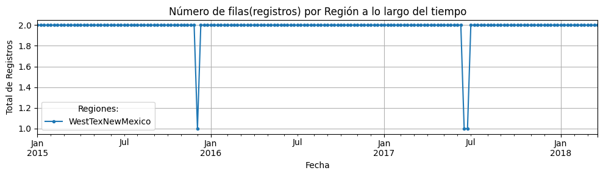
    
>[!NOTE] 
> Se comprueba que todas los registros estan referenciados a semanas, pero en algunas semanas no hay datos, sin existir nulos en el fichero. Exploramos los datos y vemos que sólo en un caso WesTexNewMexico faltan datos de dos semanas.

###  Verificamos que Total Bags = Small Bags + Large Bags + XLarge Bags
    
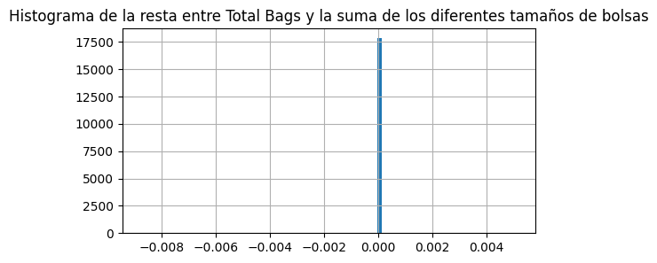
    
> [!NOTE] 
> Comprobamos que el valor de Total Bags se corresponde a la suma de los tamaños Small+Large+XLarge. Todos los valores del histograma muestran que la diferencia es cero.

# ANALISIS

## Visión global de datos
> [!NOTE] 
> Con el fin de simplificar futuros modelos, comprobamos si la suma de Total Volume de Grandes Regiones y Regiones es parecida o igual al Total Volume de Total US. Vemos que su diferencia es insignificante (3.751252636661604e-09 %)

> [!NOTE] 
> A continuación desglosamos las ventas totales para ver qué regiones son las mayores

    

  

> [!NOTE] 
> La región West aparece como la mayor de ellas seguida de California y SouthCentral. 

### Correlación de "Volumen Total" de las grandes regiones con Volumen de "Total US" (alvocado conventional)
  
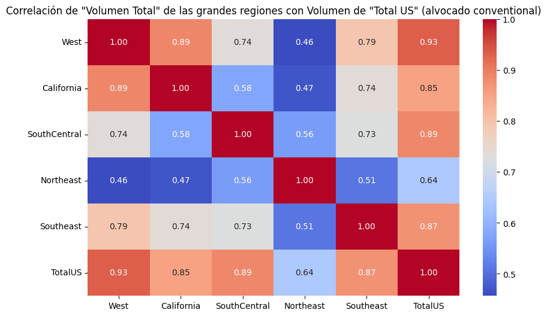
  
> [!NOTE] 
> De la matriz de correlación se observa que los volumenes de TotalUS y West están altamente correlacionadas.

### Precios promedio calibre tanto Convencional como Orgánico
> [!NOTE] 
> Buscamos la contribución de cada calibre a la formación del  precio medio del avocado mediante la matriz de correlación

    
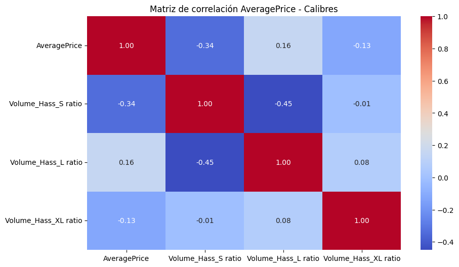
    
> [!NOTE] 
> Observamos que no hay variables correlacionadas por lo que el volumen de ventas de un calibre específico no influye en la determinación del precio medio.
    

> [!NOTE]
> Por otro lado el Volumen Total si que esta muy relacionado con las ventas de los calibres pequeños (S) y grandes (L).

```
Variables altamente correlacionadas con otras: ['Total Volume', 'Volume_Hass_S', 'Volume_Hass_L']
```

### Proporción de calibres sobre Total Volume
    
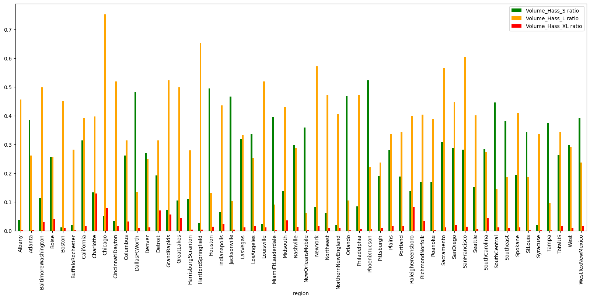
> [!NOTE] 
> Observamos que las ventas de los distintos calibres son muy distintas en cada region. No se aprecia ningun patron de ventas.
### Proporción por tipo de bolsa sobre Total Bags
    

> [!NOTE]
> Respecto al tamaño de las bolsas, podemos ver que las bolsas pequeñas tienen una mayor venta que las grandes y especialmente las muy grandes.
    
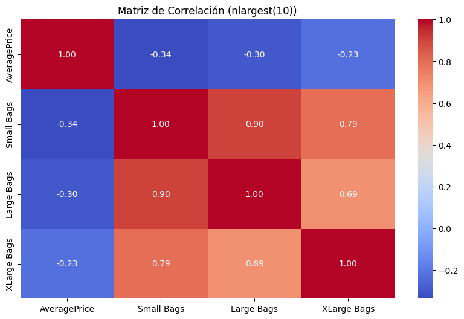
> [!NOTE] 
> De igual manera que el calibre de aguacates vendidos no influyen el precio de venta, lo mismo ocurre con el tamaño de las bolsas.

```
Variables altamente correlacionadas con otras: ['Small Bags', 'Large Bags']
```    

> [!NOTE] 
> Caso de la mayor ciudad, donde observamos el mismo comportamiento.

### Precio medio y volumen total
Observaciones:
* Estamos mostrado los de tipo convencional. Que son los grupos de puntos de la parte derecha ? TotalUS y Grandes Regions.
    
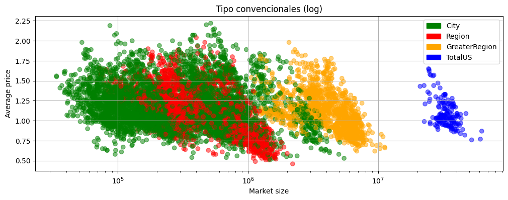
> [!NOTE]
> Considerando Total Volume como el indicativo del Maket Size, apreciamos que para cada categoria de region, el tamaño del mercado influye sobre el precio: a mayor tamaño menor precio.


### Separar avocados convencionales y organicos
    
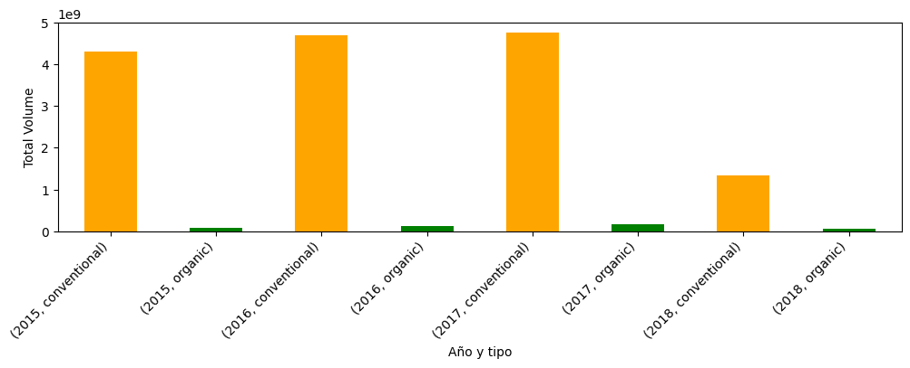
 > [!NOTE]
 > Podemos ver que años analizados la venta del organico es muy inferior a la del convecional. Seria relevante estudiar el subset eliminando los organicos o estudiarlos por separado.

    

> [!NOTE] 
> Precio medio en el total de tiempo analizado con precios semanales.
        
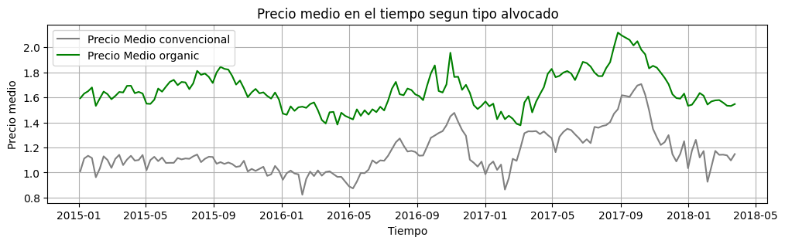

### Comparación precios promedio convencional y organico
    

> [!NOTE] 
> El grafico, que no incluye TotalUS, nos permite identificar las grandes regiones de forma detallada.
    


> [!NOTE] 
> En todas las regiones en mayor o menor grado, las ventas de convecional son ampliamente superiores al organico.


> [!NOTE] 
> Aqui observamos que en todas las regiones el tipo organico siempre es mas caro.
   
### Ventas en el tiempo y separación entre convencional / orgánico
    

> [!NOTE] 
> La disparidad de volumenes de ventas nos conduce a visualizar los datos en escala logaritmica.  
   


    
### Analisis de Series Temporales y Ruido asociado

  

> [!NOTE] 
> Periodo de 52 semanas para ver la evolucion a la lo largo de los 3 años.
> Ragos de fechas: mínima: 2015-01-04 00:00:00 máxima: 2018-03-25 00:00:00
    


----

### Super Bowl


> [!NOTE] 
> Aquí los outlayers también parecen corresponden con las fechas de la Super Bowl.
    

    

### diferencia de precio entre regiones
    

> [!NOTE] 
> Claramente hay regiones donde los aguacates son mas baratos.


> [!NOTE] 
> Por las GreaterRegion los precios son ajustados a la media o incluso inferiores, mientras que para ciudades los precios son mas elevados.
   
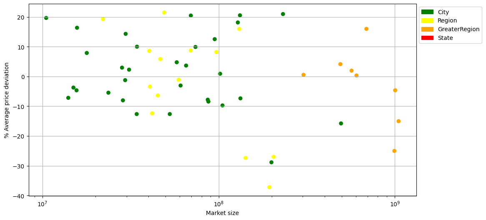

## Gráficos para Visualización de Datos

### Volumen Total de Ventas
    

> [!NOTE] 
> Se visualiza claramente los diferentes tamaños de regiones.    


> [!NOTE] 
> Se observa dos zonas de mayor frecuencia de datos, lo que indica dos categorias convencional y organico.


> [!NOTE]
> Caso de TotalUS donde observamos el mismo comportamiento.    


    

    


### Boxplot Comparativo de Precios entre Años
    

> [!NOTE] 
> En el boxplot incluyendo todos las regiones se observan numerosos outliers.
> En el año 2016 hay mayor dispersión aunque la mediana es practicamente la misma.
    

> [!NOTE] 
> Conclusiones: las ciudades y regiones al ser más pequeñas introducen más variabilidad en el precio
   


    
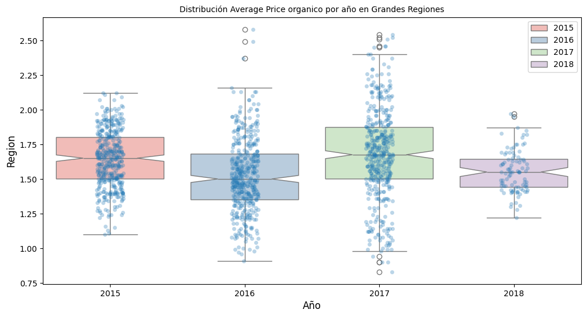
> [!NOTE] 
> En organicos, observamos mas outlayers en California que en el resto.

    


```
    type
    conventional    1.158040
    organic         1.653999
    Name: AveragePrice, dtype: float64
```

### Ventas por Tipo de Bolsa
      

    
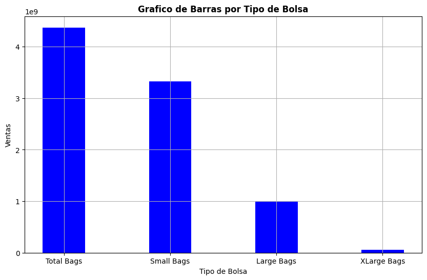
> [!NOTE] 
> Para cada uno de los tipos de aguacates, la bolsa pequeña siempre es la mas vendida.


### Total Volume respecto a la suma de los calibres de HASS: S, L y XL
    


> [!NOTE] 
> Para todos los casos de GreaterRegions y grandes ciudades, se aprecia que la suma de los calibres es siempre inferior al valor de Total Volume. Esto indicaria que se faltan informacion de otros calibres.

### Impacto del precio en las ventas
   

> [!NOTE] 
> Las diferencias del precio entre aguacate organico y convecional tiende a disminuir para mercados mas grandes.

### Estacionalidad por región
    

> [!NOTE] 
> Se observa que en general el precio es más alto en verano y otoño.


### Fechas con explosión de ventas
    

> [!NOTE] 
> Super Bowl
> * 2015: 2 de febrero
> * 2016: 7 de febrero
> * 2017: 6 de febrero
> * 2018: 5 de febrero
        

    

### Elasticidad

#### Prueba USA

* Calculo por cada region
* Creacion de la variable elasticidad y eliminacion de valores no utiles
    

    

    


#### Further studies

* Els apartats anteriors han mostrat tendencies claras, pero encara aixi es complicat separar els efectes de convergencia de múltiples variables. Es per això que tractarem de fer subsets per a veure els efectes mes clars.
* Addicionalment tractarem de fer els càlculs d'elasticitat un cop fetes les separacions en el df

#### 2.1. Elasticidad Sobre el tiempo (Conventional USA)
    

> [!NOTE] 
> Observamos que la elasticidad tiende a ser negativa con los aguacates organicos mostrando mayor tendencia hacia valores negativos.

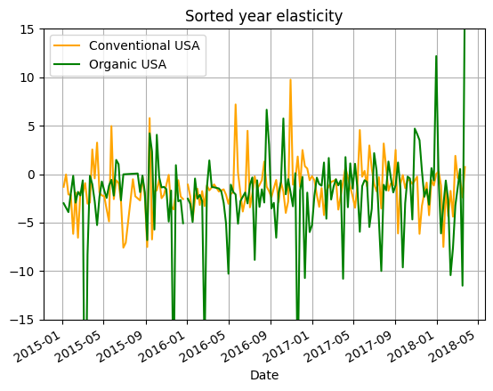
> [!NOTE] 
> La media de la elasticidad para cada tipo en Total US.

#### 2.2. Elasticidad por Regiones, harémos por regiones mas grandes y en funcion del tiempo. Solo convencionales.

* Creacion de la variable elasticidad y eliminacion de valores no utiles
    


#### Comparativa Variacion volumen precio, en tipos aguacate


> [!NOTE]
> Queda claro que la venta de aguacates organicos muestra una mayor variabilidad que los Aguacates convencionales. Esto se puede deber a que los volumenes de ventas organicos son inferiores y un pequeño cambio puede implicar variaciones % mas grandes


#### Elasticidad por region con barras


> [!NOTE]
> Todas las regiones muestran elasticidades negativas, comportamiento esperado.
    

> [!NOTE]
> En este caso observamos 3 regiones con elasticidades positivas, interpretamos que es debido a la mayor variabilidad (observada en graficos anteriores) que introducen outliers.

    

> [!NOTE]
> Aqui mostramos que no parece haber relacion entre la elasticidad y el volumen de mercado de la region. 


#### Regiones correctas Bag elasticity


<div>
<table border="1" class="dataframe">
  <thead>
    <tr style="text-align: right;">
      <th>index</th>
      <th>Date</th>
      <th>AveragePrice</th>
      <th>Total Volume</th>
      <th>Volume_Hass_S</th>
      <th>Volume_Hass_L</th>
      <th>Volume_Hass_XL</th>
      <th>Total Bags</th>
      <th>Small Bags</th>
      <th>...</th>
      <th>type</th>
      <th>year</th>
      <th>region</th>
      <th>region_class</th>
      <th>Suma Volums</th>
      <th>Variacio</th>
      <th>RegionClass</th>
      <th>Small bag elasticity</th>
      <th>Large bag elasticity</th>
      <th>XLarge bag elasticity</th>
    </tr>
  </thead>
  <tbody>
    <tr>
      <td>2379</td>
      <td>2015-03-29</td>
      <td>0.82</td>
      <td>5713017.35</td>
      <td>3091049.63</td>
      <td>1836365.62</td>
      <td>89374.20</td>
      <td>696227.90</td>
      <td>633029.23</td>
      <td>...</td>
      <td>conventional</td>
      <td>2015</td>
      <td>SouthCentral</td>
      <td>GreaterRegion</td>
      <td>5016789.45</td>
      <td>12.186693</td>
      <td>GreaterRegion</td>
      <td>2.166751</td>
      <td>-6.271725</td>
      <td>7.920000</td>
    </tr>
    <tr>
      <td>2378</td>
      <td>2015-04-05</td>
      <td>0.83</td>
      <td>6368728.85</td>
      <td>3676642.17</td>
      <td>1856953.20</td>
      <td>104285.22</td>
      <td>730848.26</td>
      <td>670637.73</td>
      <td>...</td>
      <td>conventional</td>
      <td>2015</td>
      <td>SouthCentral</td>
      <td>GreaterRegion</td>
      <td>5637880.59</td>
      <td>11.475575</td>
      <td>GreaterRegion</td>
      <td>4.871650</td>
      <td>-5.814399</td>
      <td>3166.070984</td>
    </tr>
    <tr>
      <td>2377</td>
      <td>2015-04-12</td>
      <td>0.80</td>
      <td>5930072.71</td>
      <td>3851189.34</td>
      <td>1385674.25</td>
      <td>102729.01</td>
      <td>590480.11</td>
      <td>536034.76</td>
      <td>...</td>
      <td>conventional</td>
      <td>2015</td>
      <td>SouthCentral</td>
      <td>GreaterRegion</td>
      <td>5339592.60</td>
      <td>9.957384</td>
      <td>GreaterRegion</td>
      <td>5.552947</td>
      <td>2.007227</td>
      <td>27.283777</td>
    </tr>
    <tr>
      <td>2376</td>
      <td>2015-04-19</td>
      <td>0.82</td>
      <td>5593885.09</td>
      <td>3657278.94</td>
      <td>1183497.85</td>
      <td>114923.71</td>
      <td>638184.59</td>
      <td>538970.63</td>
      <td>...</td>
      <td>conventional</td>
      <td>2015</td>
      <td>SouthCentral</td>
      <td>GreaterRegion</td>
      <td>4955700.50</td>
      <td>11.408611</td>
      <td>GreaterRegion</td>
      <td>0.219081</td>
      <td>32.911233</td>
      <td>-19.981096</td>
    </tr>
    <tr>
      <td>2375</td>
      <td>2015-04-26</td>
      <td>0.83</td>
      <td>5578980.69</td>
      <td>3637682.35</td>
      <td>1248422.73</td>
      <td>73076.91</td>
      <td>619798.70</td>
      <td>519975.08</td>
      <td>...</td>
      <td>conventional</td>
      <td>2015</td>
      <td>SouthCentral</td>
      <td>GreaterRegion</td>
      <td>4959181.99</td>
      <td>11.109533</td>
      <td>GreaterRegion</td>
      <td>-2.890019</td>
      <td>0.187701</td>
      <td>2962.375826</td>
    </tr>
  </tbody>
</table>
<p>5 rows × 22 columns</p>
</div>

```
               level_0        index                           Date  AveragePrice  \
    count   156.000000   156.000000                            156    156.000000   
    mean   5574.416667  5574.416667  2016-08-27 20:46:09.230769152      0.872372   
    min    2341.000000  2341.000000            2015-01-04 00:00:00      0.620000   
    25%    2383.500000  2383.500000            2015-11-06 06:00:00      0.780000   
    50%    5182.500000  5182.500000            2016-09-07 12:00:00      0.835000   
    75%    8024.250000  8024.250000            2017-06-19 18:00:00      0.932500   
    max    9029.000000  9029.000000            2018-03-25 00:00:00      1.340000   
    std    2450.562342  2450.562342                            NaN      0.143487   
    
           Total Volume  Volume_Hass_S  Volume_Hass_L  Volume_Hass_XL  \
    count  1.560000e+02   1.560000e+02   1.560000e+02      156.000000   
    mean   5.876758e+06   3.127538e+06   1.293206e+06   125474.259487   
    min    3.733135e+06   1.193350e+06   7.136460e+05     6332.780000   
    25%    5.201215e+06   2.710275e+06   1.016372e+06    20550.372500   
    50%    5.789486e+06   3.156223e+06   1.226489e+06    34040.720000   
    75%    6.423122e+06   3.501478e+06   1.525369e+06   121062.062500   
    max    1.032317e+07   5.160897e+06   2.390282e+06   804558.250000   
    std    1.022163e+06   5.965343e+05   3.690880e+05   179230.548562   
    
             Total Bags    Small Bags    Large Bags    XLarge Bags         year  \
    count  1.560000e+02  1.560000e+02  1.560000e+02     156.000000   156.000000   
    mean   1.330539e+06  1.044507e+06  2.708056e+05   15227.143397  2016.185897   
    min    5.547390e+05  4.422178e+05  3.172557e+04       0.000000  2015.000000   
    25%    7.645985e+05  6.166736e+05  1.279944e+05     218.467500  2015.000000   
    50%    1.324942e+06  1.011592e+06  1.861058e+05    7610.840000  2016.000000   
    75%    1.631997e+06  1.290482e+06  3.840469e+05   19846.307500  2017.000000   
    max    4.014132e+06  3.398570e+06  1.049435e+06  108072.790000  2018.000000   
    std    6.512015e+05  5.137773e+05  1.954086e+05   22483.943841     0.949054   
    
            Suma Volums    Variacio  Small bag elasticity  Large bag elasticity  \
    count  1.560000e+02  156.000000            155.000000            155.000000   
    mean   4.546219e+06   22.199844             -0.824167             -1.438783   
    min    2.739728e+06    9.720165            -19.165608           -105.635897   
    25%    4.109817e+06   13.437039             -2.578081             -5.620206   
    50%    4.573416e+06   22.325306             -0.774114             -0.376908   
    75%    5.003605e+06   28.825975              0.929297              4.480378   
    max    7.413106e+06   44.549059             22.768841             59.689860   
    std    7.659378e+05    8.309974              4.778682             19.513510   
    
           XLarge bag elasticity  
    count             155.000000  
    mean               26.785477  
    min             -3336.353066  
    25%               -13.395692  
    50%                -0.180621  
    75%                10.925953  
    max              3166.070984  
    std               480.220418  
```
    


> [!NOTE]
> La elasticidad de las bolsas viene dominada por XLarge, se tratan de valores inferiores a los aguacates organicos. Por lo tanto, se introducen outliers que influyen a la media en gran medida.


> [!NOTE]
> Al eliminar XLarge bags, observamos un resultado mas acorde a los anteriores. Elasticidades negativas en su mayoria.
    
        
### Analisis por cohortes

##### 1. Cohortes Basadas en Precios Promedios Trimestrales:


> [!NOTE] Se observa como baja el volumen de ventas a medida que sube el Average Price de forma "sincronizada". 
> Los picos rojos muestran la coincidencia con las fechas de la Super Bowl.


##### 3. Análisis de Cohortes en Función del Tipo de Bolsa:
   

> [!NOTE]
> Los Total Bags son constituidos principalmente por Small Bags. Large Bags siguen la tendencia pero no influyen y XLarge Bags no parecen imitar a los otros calibres. Esto coincide con los datos de la matriz de correlación.


##### 4. Cohortes de Clientes Basadas en Ventas:
  
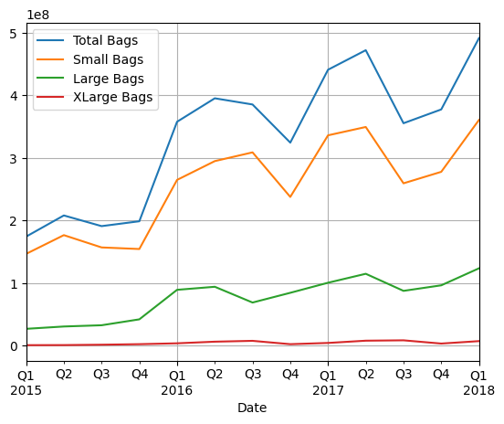

> [!NOTE]
> Una vez mas observamos los efectos de la superbowl en las ventas del aguacate. Su efecto se extiende a todas las regiones, siendo este mas marcado en regiones con mayores volumenes de mercado.
    

> [!NOTE]
> Zoom-in  del grafico anterior.
    

    
#### Matriz de correlaciones de todas las variables según  apartado 5.6. En especial, precio medio y relación con diferentes calibres.
    
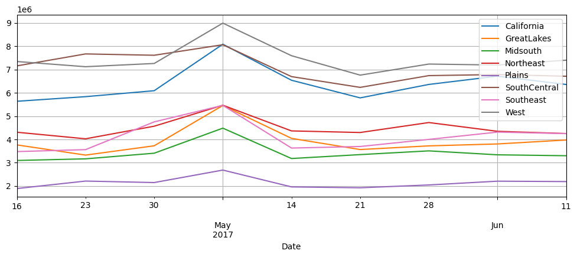

```
    Variables altamente correlacionadas con otras: ['Total Volume', 'Total Bags', 'Volume_Hass_L']
```
> [!Note]
> Vemos una vez mas que la mayor parte de las variables estan relacionadas. XLarge volume se comporta erraticamente por las mismas razones que XLarge bags (Valores pequeños) y average price muestra una correlación moderada y negativa.


#### Dispersión entre variables claves según 5.2


<div>
<table border="1" class="dataframe">
  <thead>
    <tr style="text-align: right;">
      <th>index</th>
      <th>Date</th>
      <th>AveragePrice</th>
      <th>Total Volume</th>
      <th>Volume_Hass_S</th>
      <th>Volume_Hass_L</th>
      <th>Volume_Hass_XL</th>
      <th>Total Bags</th>
      <th>Small Bags</th>
      <th>Large Bags</th>
      <th>XLarge Bags</th>
      <th>type</th>
      <th>year</th>
      <th>region</th>
      <th>region_class</th>
      <th>Suma Volums</th>
      <th>Variacio</th>
      <th>RegionClass</th>
    </tr>
  </thead>
  <tbody>
    <tr>
      <td>11798</td>
      <td>2015-08-09</td>
      <td>1.0</td>
      <td>625259.0</td>
      <td>170184.0</td>
      <td>269330.0</td>
      <td>6905.0</td>
      <td>178838.0</td>
      <td>126058.0</td>
      <td>52779.0</td>
      <td>0.0</td>
      <td>organic</td>
      <td>2015</td>
      <td>TotalUS</td>
      <td>TotalUS</td>
      <td>446419.0</td>
      <td>28.602547</td>
      <td>TotalUS</td>
    </tr>
    <tr>
      <td>11799</td>
      <td>2015-08-02</td>
      <td>1.0</td>
      <td>573873.0</td>
      <td>164126.0</td>
      <td>263359.0</td>
      <td>5115.0</td>
      <td>141271.0</td>
      <td>93120.0</td>
      <td>48151.0</td>
      <td>0.0</td>
      <td>organic</td>
      <td>2015</td>
      <td>TotalUS</td>
      <td>TotalUS</td>
      <td>432600.0</td>
      <td>24.617468</td>
      <td>TotalUS</td>
    </tr>
    <tr>
      <td>11800</td>
      <td>2015-07-26</td>
      <td>1.0</td>
      <td>580826.0</td>
      <td>169940.0</td>
      <td>266249.0</td>
      <td>4391.0</td>
      <td>140244.0</td>
      <td>71807.0</td>
      <td>68436.0</td>
      <td>0.0</td>
      <td>organic</td>
      <td>2015</td>
      <td>TotalUS</td>
      <td>TotalUS</td>
      <td>440580.0</td>
      <td>24.145958</td>
      <td>TotalUS</td>
    </tr>
    <tr>
      <td>11801</td>
      <td>2015-07-19</td>
      <td>1.0</td>
      <td>650389.0</td>
      <td>159752.0</td>
      <td>317728.0</td>
      <td>4758.0</td>
      <td>168149.0</td>
      <td>81667.0</td>
      <td>86482.0</td>
      <td>0.0</td>
      <td>organic</td>
      <td>2015</td>
      <td>TotalUS</td>
      <td>TotalUS</td>
      <td>482238.0</td>
      <td>25.853912</td>
      <td>TotalUS</td>
    </tr>
    <tr>
      <td>11802</td>
      <td>2015-07-12</td>
      <td>1.0</td>
      <td>608845.0</td>
      <td>178871.0</td>
      <td>267353.0</td>
      <td>5093.0</td>
      <td>157526.0</td>
      <td>80220.0</td>
      <td>77305.0</td>
      <td>0.0</td>
      <td>organic</td>
      <td>2015</td>
      <td>TotalUS</td>
      <td>TotalUS</td>
      <td>451317.0</td>
      <td>25.873252</td>
      <td>TotalUS</td>
    </tr>
    <tr>
      <td>11803</td>
      <td>2015-07-05</td>
      <td>1.0</td>
      <td>668233.0</td>
      <td>205073.0</td>
      <td>304597.0</td>
      <td>6251.0</td>
      <td>152309.0</td>
      <td>88261.0</td>
      <td>64048.0</td>
      <td>0.0</td>
      <td>organic</td>
      <td>2015</td>
      <td>TotalUS</td>
      <td>TotalUS</td>
      <td>515921.0</td>
      <td>22.793247</td>
      <td>TotalUS</td>
    </tr>
  </tbody>
</table>
</div>


    

> [!NOTE]
> Aunque en este caso no parece que el Average Price cambie con el Total Volume, si nos fijamos existe un grupo de outliers que es sospechoso de estar afectando negativamente a la regresion ya que parecen ser escogidos artificialmente.    
    

> [!NOTE]
> Al eliminar los outliers, se observa una tendencia a precios inferiores a medida que aumenta el volumen


    

> [!NOTE]
> Al extender el plot a otras regiones (Todas als ciudades), interpretar el grafico se complica, pero sigue mostrando la misma tendencia.  


### REGRESIONES Y PROYECCIONES

#### Ejemplo De Modelo Final


#### West: Primer ejemplo del modelo Final que vamos a mostrar. Incluye un plotting avanzado y las variables X más importantes

``` 
    Comparación de los primeros 10 valores entre el valor predicho y el valor real:
        Valor Real  Valor Predicho  Error Porcentual
    0        1.04        1.139885         -9.604288
    1        1.41        1.438219         -2.001369
    2        1.83        1.799041          1.691744
    3        1.01        0.940126          6.918212
    4        1.37        1.346056          1.747743
    5        1.53        1.528976          0.066899
    6        0.99        0.911013          7.978496
    7        1.39        1.349376          2.922580
    8        1.43        1.422922          0.494951
    9        0.98        0.904683          7.685384
    
    Error cuadrático medio (MSE) del modelo: 0.0073
    El coeficiente Standard Volume	 	: -157909.33551370245
    El coeficiente year	 	            : 119074.52579389374
    El coeficiente n_week	 	          : -532309.8827663932
    El coeficiente type_Bool	 	      : -6858.844755373939
    
    Valor R² del modelo: 0.947217
    
    La diferencia entre los Valores R² del modelo: 0.010426
```
> [!NOTE]
> Esta es una prueba de concepto del funcionamiento del modelo para estas variables dependientes. La única variable que precisara estimación en las futuras predicciones sera unicamente Total Volume facilitandonos el proceso. (Total Volume es la variable mas correlacionada con AvPrice)


> [!NOTE]
>El grafico muestra una buena relacion entre el modelo y los datos reales.

## Comparación de módelos

<div>

<table border="1" class="dataframe">
  <thead>
    <tr style="text-align: right;">
      <th>index</th>
      <th>Region</th>
      <th>Variables</th>
      <th>R_2</th>
      <th>Var_R</th>
      <th>Random_seed</th>
    </tr>
  </thead>
    <tbody>
    <tr>
      <th>200</th>
      <td>California</td>
      <td>[Standard Volume, year, n_week, type_Bool]</td>
      <td>0.969116</td>
      <td>0.021308</td>
      <td>20</td>
    </tr>
    <tr>
      <th>196</th>
      <td>California</td>
      <td>[Standard Volume, year, n_week, type_Bool]</td>
      <td>0.961284</td>
      <td>0.000971</td>
      <td>16</td>
    </tr>
    <tr>
      <th>195</th>
      <td>California</td>
      <td>[Standard Volume, year, n_week, type_Bool]</td>
      <td>0.961119</td>
      <td>0.002489</td>
      <td>15</td>
    </tr>
    <tr>
      <th>208</th>
      <td>California</td>
      <td>[Standard Volume, year, n_week, type_Bool]</td>
      <td>0.961030</td>
      <td>0.000401</td>
      <td>28</td>
    </tr>
    <tr>
      <th>207</th>
      <td>California</td>
      <td>[Standard Volume, year, n_week, type_Bool]</td>
      <td>0.960159</td>
      <td>0.002380</td>
      <td>27</td>
    </tr>
    <tr>
      <th>209</th>
      <td>California</td>
      <td>[Standard Volume, year, n_week, type_Bool]</td>
      <td>0.956538</td>
      <td>0.006213</td>
      <td>29</td>
    </tr>
    <tr>
      <th>192</th>
      <td>California</td>
      <td>[Standard Volume, year, n_week, type_Bool]</td>
      <td>0.950903</td>
      <td>0.012921</td>
      <td>12</td>
    </tr>
    <tr>
      <th>184</th>
      <td>California</td>
      <td>[Standard Volume, year, n_week, type_Bool]</td>
      <td>0.950259</td>
      <td>0.011986</td>
      <td>4</td>
    </tr>
    <tr>
      <th>182</th>
      <td>California</td>
      <td>[Standard Volume, year, n_week, type_Bool]</td>
      <td>0.946988</td>
      <td>0.015874</td>
      <td>2</td>
    </tr>
    <tr>
      <th>187</th>
      <td>California</td>
      <td>[Standard Volume, year, n_week, type_Bool]</td>
      <td>0.944280</td>
      <td>0.020581</td>
      <td>7</td>
    </tr>
    <tr>
      <th>180</th>
      <td>California</td>
      <td>[Standard Volume, year, n_week, type_Bool]</td>
      <td>0.942221</td>
      <td>0.013155</td>
      <td>0</td>
    </tr>
    <tr>
      <th>181</th>
      <td>California</td>
      <td>[Standard Volume, year, n_week, type_Bool]</td>
      <td>0.941372</td>
      <td>0.023124</td>
      <td>1</td>
    </tr>
    <tr>
      <th>201</th>
      <td>California</td>
      <td>[Standard Volume, year, n_week, type_Bool]</td>
      <td>0.940869</td>
      <td>0.025151</td>
      <td>21</td>
    </tr>
    <tr>
      <th>185</th>
      <td>California</td>
      <td>[Standard Volume, year, n_week, type_Bool]</td>
      <td>0.937268</td>
      <td>0.025766</td>
      <td>5</td>
    </tr>
    <tr>
      <th>183</th>
      <td>California</td>
      <td>[Standard Volume, year, n_week, type_Bool]</td>
      <td>0.935031</td>
      <td>0.027537</td>
      <td>3</td>
    </tr>
    <tr>
      <th>197</th>
      <td>California</td>
      <td>[Standard Volume, year, n_week, type_Bool]</td>
      <td>0.934183</td>
      <td>0.030067</td>
      <td>17</td>
    </tr>
    <tr>
      <th>188</th>
      <td>California</td>
      <td>[Standard Volume, year, n_week, type_Bool]</td>
      <td>0.934101</td>
      <td>0.032783</td>
      <td>8</td>
    </tr>
    <tr>
      <th>205</th>
      <td>California</td>
      <td>[Standard Volume, year, n_week, type_Bool]</td>
      <td>0.928692</td>
      <td>0.036341</td>
      <td>25</td>
    </tr>
    <tr>
      <th>191</th>
      <td>California</td>
      <td>[Standard Volume, year, n_week, type_Bool]</td>
      <td>0.920365</td>
      <td>0.047328</td>
      <td>11</td>
    </tr>
    <tr>
      <th>202</th>
      <td>California</td>
      <td>[Standard Volume, year, n_week, type_Bool]</td>
      <td>0.916904</td>
      <td>0.039428</td>
      <td>22</td>
    </tr>
    <tr>
      <th>204</th>
      <td>California</td>
      <td>[Standard Volume, year, n_week, type_Bool]</td>
      <td>0.913382</td>
      <td>0.008611</td>
      <td>24</td>
    </tr>
    <tr>
      <th>194</th>
      <td>California</td>
      <td>[Standard Volume, year, n_week, type_Bool]</td>
      <td>0.909448</td>
      <td>0.055801</td>
      <td>14</td>
    </tr>
    <tr>
      <th>193</th>
      <td>California</td>
      <td>[Standard Volume, year, n_week, type_Bool]</td>
      <td>0.900903</td>
      <td>0.068461</td>
      <td>13</td>
    </tr>
    <tr>
      <th>186</th>
      <td>California</td>
      <td>[Standard Volume, year, n_week, type_Bool]</td>
      <td>0.887624</td>
      <td>0.074162</td>
      <td>6</td>
    </tr>
    <tr>
      <th>189</th>
      <td>California</td>
      <td>[Standard Volume, year, n_week, type_Bool]</td>
      <td>0.836219</td>
      <td>0.128469</td>
      <td>9</td>
    </tr>
    <tr>
      <th>203</th>
      <td>California</td>
      <td>[Standard Volume, year, n_week, type_Bool]</td>
      <td>0.830027</td>
      <td>0.133698</td>
      <td>23</td>
    </tr>
    <tr>
      <th>199</th>
      <td>California</td>
      <td>[Standard Volume, year, n_week, type_Bool]</td>
      <td>0.826867</td>
      <td>0.132243</td>
      <td>19</td>
    </tr>
    <tr>
      <th>198</th>
      <td>California</td>
      <td>[Standard Volume, year, n_week, type_Bool]</td>
      <td>0.819750</td>
      <td>0.142341</td>
      <td>18</td>
    </tr>
    <tr>
      <th>206</th>
      <td>California</td>
      <td>[Standard Volume, year, n_week, type_Bool]</td>
      <td>0.816671</td>
      <td>0.147909</td>
      <td>26</td>
    </tr>
    <tr>
      <th>190</th>
      <td>California</td>
      <td>[Standard Volume, year, n_week, type_Bool]</td>
      <td>0.761638</td>
      <td>0.199002</td>
      <td>10</td>
    </tr>
  </tbody>
</table>
</div>

> [!NOTE]
>Despues de calcular la fiabilidad del modelo para todas las regiones y multiples random seeds, determinamos que California con un random seed de 20 seria nuestra mejor caso de modelizacion.


#### Entrenamiento modelo Total Volume


* Para poder predecir el average price en un periodo que no conocemos, necesitamos predecir previamente el volúmen de venta o Total Volume

* Este modelo sera por una sola región, California


* Creación de modelo total Volume


```
    Valor R² del modelo: 0.967640
    
    La diferencia entre los Valores R² del modelo: -0.007140
```

### Visualización modelo total Volume


> [!NOTE]
> Visualizamos los resultados del modelo de total Volume. En este caso como las variables independientes son únicamente temporales es muy dificil poder obtener un valor suficientemente certero. Aun asi esta estimación sera suficiente.


#### Prediccion Total Volume
    

> [!NOTE]
> Aplicamos el modelo para extrapolar los datos y observamos una tendencia coherente con las fechas anteriores.

#### Creación Modelo Average Price vs [Standard Volume, year, Nº week, Type_Avocado]

```
    Valor R² del modelo: 0.969116   
    La diferencia entre los Valores R² del modelo: -0.021308
```
> [!NOTE]
> Entrenamos el modelo de AVPrice de California al que introduciremos las predicciones del modelo Total Volume


#### Visualización predicciones
    

> [!NOTE]
> Finalmente hemos obtenido las predicciones, extrapolando a futuras fechas. Observamos que las predicciones superpuestas del modelo de Volumen son funcionales y dan fiabilidad a la extrapolacion.


